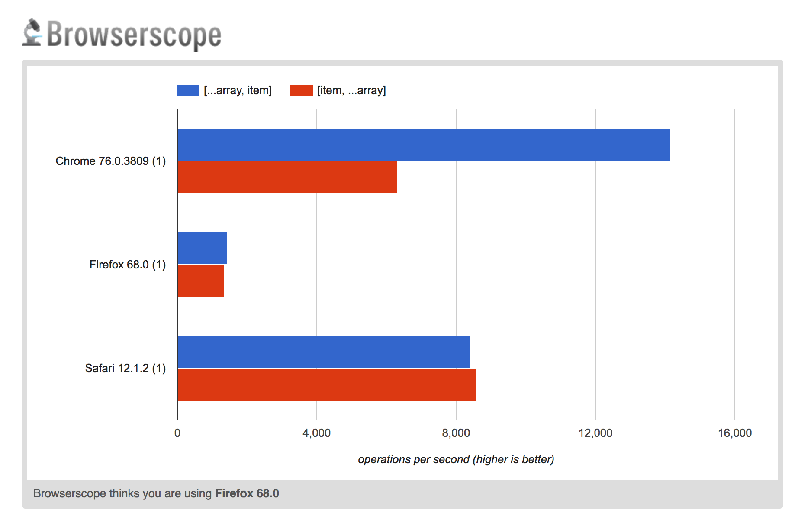

In this post, you will read an interesting investigation on how to boost the performance of the spread operator.  

Let's start with a short introduction on how spread operator works inside array literals. 

The spread operator, or three dots, takes an array or generally an iterable `[...arrayOrIterable]` and slices it into pieces. Then the array literal uses these pieces to construct a new array.  

The spread operator can be placed at any position inside the array literal:

```javascript
const numbers = [1, 2, 3];
[0, ...numbers];    // => [0, 1, 2, 3]
[0, ...numbers, 4]; // => [0, 1, 2, 3, 4]
[...numbers, 4];    // => [1, 2, 3, 4]
```

Now comes the interesting question. Is there a position of the spread operator inside the array literal that could increase performance? Let's find out.  

*Before I continue, allow me to make a recommendation.* 

*If you want to significantly improve your JavaScript knowledge, I recommend the amazingly useful ["Modern JavaScript From The Beginning 2.0"](https://www.traversymedia.com/a/2147528886/FqXWyazh) by Brad Traversy. Use the coupon code "DMITRI" and get up to 20% discount!*

## 1. Append to head and to tail functions

Before starting the performance comparisons, let's define two functions.

The first one is `appendToTail()`:

```javascript{1}
function appendToTail(item, array) {
  return [...array, item];
}

const numbers = [1, 2, 3];
appendToTail(10, numbers); // => [1, 2, 3, 10]
```

`appendToTail()` inserts the item at the end of the array. This function uses  `[...array, item]`.

The second one is `appendToHead()`:  

```javascript{1}
function appendToHead(item, array) {
  return [item, ...array];
}

const numbers = [1, 2, 3];
appendToHead(10, numbers); // => [10, 1, 2, 3]
```

`appendToHead()` is a pure function that returns a new array where the item is appended at the head of the original array. It uses `[item, ...array]`.

At first sight, there's no reason to think that these functions perform differently. But let's take a try.

## 2. The performance test

Let's run [the performance test](https://jsperf.com/spread-operator-head-vs-tail/5) of `[...array, item]` vs `[item, ...array]` on a MacBook Pro laptop in the following 3 browsers: 

* Chrome 76
* Firefox 68 
* Safari 12.1

Here are the performance test results:  


As expected, in Firefox and Safari browsers `[...array, item]` and `[item, ...array]` have the same performance.  

In Chrome, however, `[...array, item]` performs *twice* faster than `[item, ...array]`. That's a useful result.  

To accelerate the performance of spread operator in Chrome, use the spread operator at the beginning of the array literal:  

```javascript
const result = [...array, item];
```

But another question arises: why does it happen?  

## 3. The fast-path optimization

Starting the version `7.2` of the V8 engine (that powers the JavaScript execution in Chrome) a new optimization of the spread operator is available: *the fast-path optimization*.  

In a few sentences, it works as follows. 

Without this optimization, when the engine encounters a spread operator `[...iterable, item]`, it invokes the iterator (`iterator.next()`) of the iterable object. On each iteration, the memory of the resulted array is increased, and the iteration result is added to it.  

But *the fast-path optimization* detects a known iterable (like an array of integers) and skips the creation of the iterator object at all. Then the engine reads the length of the spread array, allocating only *once* memory for the resulted array. Then passes by index the spread array, adding each item to the resulted array.  

The fast-path optimization skips the creation of the iteration object, allocating the memory for the result only once. Thus the performance increase.  

## 4. Supported data structures

The fast-path optimization applies to the following standard JavaScript data structures.  

#### Arrays

```javascript
const numbers = [1, 2, 3, 4];

[...numbers, 5]; // => [1, 2, 3, 4, 5]
```

#### Strings

```javascript
const message = 'Hi';

[...message, '!']; // => ['H', 'i', '!']
```

#### Sets

```javascript
const colors = new Set(['blue', 'white']);

[...colors, 'green'];          // => ['blue', 'white', 'green']
[...colors.values(), 'green']; // => ['blue', 'white', 'green']
[...colors.keys(), 'green'];   // => ['blue', 'white', 'green']
```

### Maps

On maps only `map.keys()` and `map.values()` methods are supported:

```javascript
const names = new Map([[5, 'five'], [7, 'seven']]);

[...names.values(), 'ten']; // => ['five', 'seven', 'ten']
[...names.keys(), 10];      // => [5, 7, 10]
```

## 5. Conclusion

When the spread array is located at the beginning of the array literal, you can get a performance boost due to the fast-path optimization. It is available in V8 engine `v7.2` (shipped in Chrome `v72` and NodeJS `v12`).   

With this optimization, [the performance test](https://jsperf.com/spread-operator-head-vs-tail/5) shows that `[...array, item]` can perform at least twice faster than `[item, ...array]`.  

Note that while fast-path is indeed useful, you might want to use it in places where the performance is important, or if you'll dealing with large arrays. 

Otherwise, in most situations, don't force the optimization since the end-user most likely will not feel the difference.  

*What interesting performance optimizations in JavaScript do you know?*  