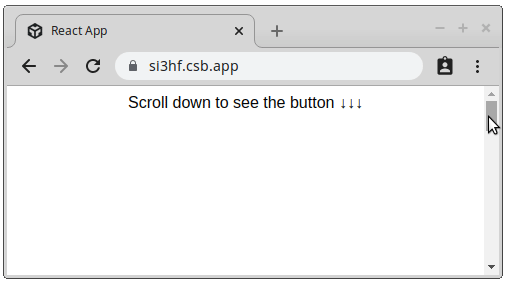

## 1. Why good system design is important

About 5 years ago, I was developing a cross-platform mobile application for a European startup. The first series of features were easy to implement. I was progressing well and was happy about that.    

6 months passed by. More features were added on top of previous ones. Step by step, making new changes to existing modules was becoming increasingly harder.  

At some point, I started rejecting some new features and changes because they would require too much time to implement. The story had ended with a whole rewrite of the mobile apps to the native platform, mainly because further maintenance would be unreasonably expensive.  

I blamed the bugs in the cross-platform framework, blamed that client was changing requirements, and so on. 

But these weren't the main problem. Without realizing it, I was fighting tightly coupled components like Don Quijote was fighting the windmills.  


*I overlooked the importance of making my components easy to change.* I didn't follow the principles of good design and didn't make my components adaptable to potential changes.  

Don't make my mistake: learn design principles. One particularly influential is the orthogonality principle, which says to isolate things that change for different reasons.  

*Before I continue, allow me to make a recommendation.* 

*If you want to significantly improve your React knowledge, I recommend the fantastic ["React Front To Back Course"](https://www.traversymedia.com/a/2147528895/FqXWyazh) by Brad Traversy. Use the coupon code "DMITRI" and get up to 20% discount!*

## 2. Orthogonal components

If A and B are *orthogonal*, then changing A does not change B (and vice-versa). That's the concept of *orthogonality*.  

In a radio device, the volume and station selection controls are orthogonal. The volume control changes only the sound volume. The station selection control changes only the received radio  station.  


Imagine the radio device has broken. The volume control changes the volume, but also diverts the selected radio station. The volume control and station selection controls are non-orthogonal — the volume control produces a side-effect.  

It would be difficult to tune the broken radio device. The same happens when you try to add changes to tightly coupled components: you're forced to catch the side-effects of your changes.  

Two or more components are orthogonal if a change in one component does not affect other components. For example, a component that displays a list of employees should be orthogonal to the logic that fetches the employees.  

A good React application design would make orthogonal:  

* The UI elements (the presentational components)
* Fetch details (fetch library, REST or GraphQL)
* Global state management (Redux)
* Persistence logic (local storage, cookies).

Make your components implement one task, be isolated, self-contained and encapsulated. This will make your components orthogonal, and any change you make is going to be isolated and focused on just one component. That's the recipe for predictable and easy to develop systems.  

Let's see how to do that in 2 examples.  

## 3. Making the component orthogonal to fetch details

Let's say you need to fetch a list of employees. One version of `<EmployeesPage>` could be as follows:

```jsx{11}
import React, { useState } from 'react';
import axios from 'axios';
import EmployeesList from './EmployeesList';

function EmployeesPage() {
  const [isFetching, setFetching] = useState(false);
  const [employees, setEmployees] = useState([]);

  useEffect(function fetch() {
    (async function() {
      setFetching(true);
      const response = await axios.get("/employees");
      setEmployees(response.data);
      setFetching(false);
    })();
  }, []);
  
  if (isFetching) {
    return <div>Fetching employees....</div>;
  }
  return <EmployeesList employees={employees} />;
}
```

[Try the demo](https://codesandbox.io/s/non-orthogonal-fetch-s6f9e)

The problem with the current implementation is that `<EmployeesPage>` depends on how data is fetched. The component knows about `axios` library, knows that a `GET` request is performed. 

What would happen if later you switch from `axios` and REST to GraphQL? If the application has dozens of components coupled with fetching logic, you would have to change them all manually.  

There's a better approach. Let's isolate the fetch logic details from the component.  

A good way to do this is to use the new Suspense feature of React:

```jsx
import React, { Suspense } from "react";
import EmployeesList from "./EmployeesList";

function EmployeesPage({ resource }) {
  return (
    <Suspense fallback={<h1>Fetching employees....</h1>}>
      <EmployeesFetch resource={resource} />
    </Suspense>
  );
}

function EmployeesFetch({ resource }) {
  const employees = resource.employees.read();
  return <EmployeesList employees={employees} />;
}
```

[Try the demo](https://codesandbox.io/s/orthogonal-fetch-crko3)

`<EmployeesPage>` now suspends when until `<EmployeesFetch>` reads the resource async.  

*What's important is `<EmployeesPage>` is orthogonal to the fetching logic.*

`<EmployeesPage>` doesn't care that `axios` implements fetching. You could easily change `axios` to native `fetch`, or move to GraphQL: `<EmployeesPage>` is not affected.  

## 4. Making the view orthogonal to scroll listener

Let's say you want to a *Jump to top* button that shows when the user scrolls down more than 500px. When the button is clicked, the page automatically scrolls to the top.  



The first naive implementation of `<ScrollToTop>` can be:

```jsx
import React, { useState, useEffect } from 'react';

const DISTANCE = 500;

function ScrollToTop() {
  const [crossed, setCrossed] = useState(false);

  useEffect(
    function() {
      const handler = () => setCrossed(window.scrollY > DISTANCE);
      handler();
      window.addEventListener("scroll", handler);
      return () => window.removeEventListener("scroll", handler);
    },
    []
  );

  function onClick() {
    window.scrollTo({
      top: 0,
      behavior: "smooth"
    });
  }

  if (!crossed) {
    return null;
  }
  return <button onClick={onClick}>Jump to top</button>;
}
```

[Try the demo](https://codesandbox.io/s/non-orthogonal-scroll-detect-si3hf)

`<ScrollToTop>` implements the scroll listener and renders a button that scrolls the page to top. The issue is that these concepts can change at different rates.  

A better orthogonal design should isolate the scroll listener from the UI. 

Let's extract the scroll listener logic into a custom hook `useScrollDistance()`:

```javascript
import { useState, useEffect } from 'react';

function useScrollDistance(distance) {
  const [crossed, setCrossed] = useState(false);

  useEffect(function() {
    const handler = () => setCrossed(window.scrollY > distance);
    handler();
    window.addEventListener("scroll", handler);
    return () => window.removeEventListener("scroll", handler);
  }, [distance]);

  return crossed;
}
```

Then let's use `useScrollAtBottom()` inside a component `<IfScrollCrossed>`:

```jsx
function IfScrollCrossed({ children, distance }) {
  const isBottom = useScrollDistance(distance);
  return isBottom ? children : null;
}
```

`<IfScrollCrossed>` displays its children only if the user has scrolled a specific distance.  

Finally, here's the button that scrolls to top when clicked:

```jsx
function onClick() {
  window.scrollTo({
    top: 0,
    behavior: 'smooth'
  });
}

function JumpToTop() {
  return <button onClick={onClick}>Jump to top</button>;
}
```

Now if you want to make everything work, just put `<JumpToTop>` as a child of `<IfAtBottom>`:

```jsx
import React from 'react';

// ...

const DISTANCE = 500;

function MyComponent() {
  // ...
  return (
    <IfScrollCrossed distance={DISTANCE}>
      <JumpToTop />
    </IfScrollCrossed>
  );
}
```

[Try the demo](https://codesandbox.io/s/orthogonal-scroll-detect-wko57)

What's important is that `<IfScrollCrossed>` isolates the changes of scroll listener. As well as UI elements changes are isolated in `<JumpToTop>` component.  

*Scroll listener logic and UI elements are orthogonal.*  

An additional benefit is that you can combine `<IfScrollCrossed>` with any other UI. For example, you could show a newsletter form when user has scrolled down 300px:

```jsx
import React from 'react';

// ...

const DISTANCE_NEWSLETTER = 300;

function OtherComponent() {
  // ...
  return (
    <IfScrollCrossed distance={DISTANCE_NEWSLETTER}>
      <SubscribeToNewsletterForm />
    </IfScrollCrossed>
  );
}
```

## 5. The "Main" component

While isolating changes into separate components is what orthogonality is all about, there could be components that can change for different reasons. These are so-called "Main" (aka "App") components. 

You can find the "Main" component inside the `index.jsx` file: the one that starts the application. It knows all the "dirty" details about the application: initializes the global state provider (like Redux), configures the fetching libraries (like GraphQL Apollo), associates routes with components, and so on.  

You might have several "Main" components: for the client side (to run inside a browser) and for server side (that implements Server-Side Rendering).  

## 6. The benefits of orthogonal design

The orthogonal design provides lots of benefits.

### Easy to change

When your components are orthogonally designed, any change you make to a component is isolated within the component.  

### Readability

Because the orthogonal component has one responsibility, it's much easier to understand what the component does. It is not cluttered with details that do not belong here.  

### Testability

Orthogonal components concentrate solely on implementing a single task. What you have to do is just test whether the component does the task correctly.  

Often it happens that a non-orthogonal component requires lots of mocks and manual setup just to test it. And if something is hard to test, eventually tests are going to be skipped. You just refactor such components.  

## 7. Think in principles

I like the new React features like hooks, suspense, etc. But I try to think wider, exploring whether these features help me follow the good design.  

* *Why React hooks?* They make UI rendering logic orthogonal to state and side-effects logic.  
* *Why Suspense for fetching?* It makes the fetch details and components orthogonal.  

## 8. The balance

Let's recall [a scene](https://www.youtube.com/watch?v=D4UiQX-Rf3U) from "Star Wars Revenge of the Sith" movie. After Anakin Skywalker is defeated by his former mentor Obi-Wan Kenobi, the latter says:

> Bring balance to the Force, not leave it in darkness!

Anakin Skywalker was chosen to become a Jedi and bring a *balance* between Dark and Light sides.  


The orthogonal design is balanced by ["You aren't gonna need it"](https://deviq.com/yagni/) (YAGNI) principle.  

YAGNI emerges as a principle of Extreme Programming:

> Always implement things when you actually need them, never when you just foresee that you may need them.

Avoid the extremes of both orthogonality and YAGNI.  

Recall my story from the intro of the post: I ended up with an application that was difficult and costly to change. My mistake was that I unintentionally created components that were not designed for change. That's an extreme of YAGNI.  

On the other side, if you make every piece of logic orthogonal, you will end up creating abstractions that are not going to be needed. That's an extreme of orthogonal design.  

The practical approach is to foresee the changes. Study in detail the domain problem that your application solves, ask the client for a list of *potential* features. If you think that a certain place is going to change, then apply the orthogonal principle.  

## 8. Key takeaway

Writing software is not only about implementing the application's requirements. It's equally important to put effort into designing well the components.  

A key principle of a good design is the isolation of the logic that most likely will change: making it orthogonal. This makes your whole system flexible and adaptable to change or new features requirements.  

If the orthogonal principle is overlooked, you risk creating components that are tightly coupled and dependent. A slight change in one place might unexpectedly echo in another place, increasing the cost of change, maintenance and creating new features.

Would you like to know more? Then your next step is to read [The Pragmatic Programmer](https://www.amazon.com/Pragmatic-Programmer-journey-mastery-Anniversary-ebook/dp/B07VRS84D1).
