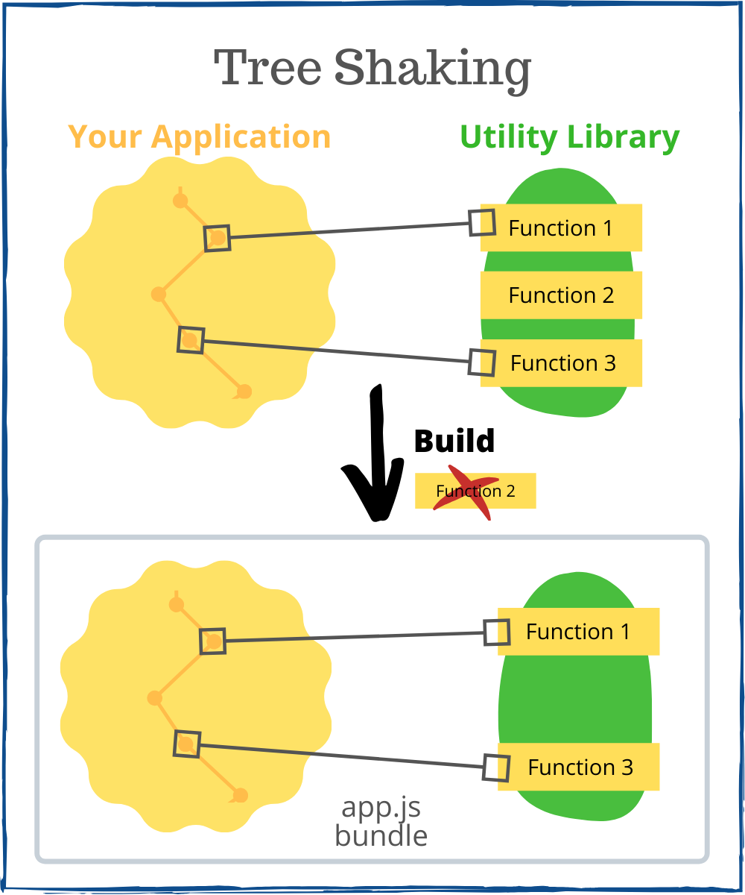

The big JavaScript bundle is a common performance problem in Frontend development. Nobody likes slow, heavy applications and looking at the loading spinner.  

The utility libraries (collections of functions implementing common tasks like finding unique items of an array, formatting dates, etc.) impact heavily the bundle size. Examples of utility libraries in JavaScript are Lodash, Ramda, Date-fns, Math.js.  

Let's discuss when it makes sense to use utility libraries. And importantly, how to integrate libraries to minimally affect the bundle size.  

## 1. My rule of thumb

If the following is true for a particular problem:

> Writing the solution by yourself would look similar to the solution provided by the utility library.  

then it's ok to use the utility library.  

In simple words, you want to avoid reinventing the wheel and leverage existing solutions.  

Let's continue looking at some pros and cons of using utility libraries.  

## 2. The pros

### 2.1 Prevents reinventing the wheel

The main benefit of utility libraries is code reuse. When facing a problem, research if there isn't a good solution already.  

The common Frontend problems like:

* Operations on arrays
* Complex string manipulations
* Formatting dates
* URL parse and stringify
* and alike

are already solved by utility libraries.  

And let's be honest. Writing *your own date formatting utility* when developing a Frontend application is wasting of time.  

### 2.2 Quality

Popular utility libraries provide more than just a solution to common problems.  

When you're using a quality library, you inherit these nice benefits:

* The *well documented* library lets you spend less time in understanding how to use it.  
* The *well tested* library demonstrates that it behaves correctly, even in edge cases.
* Known libraries are *performance* checked too, so you can be sure there's no performance bottleneck.  
* Known libraries are used by hundreds of developers in hundreds of applications: is bullet-proofed by the community.

## 3. The cons

### 3.1 Bundle size increase

The usage of a utility comes with costs. The first one being the potential increase of the bundle size.

Bundle size increases too much when you include the whole library. You should always cherry pick only the functions that you use.  

For example, importing `lodash` library such way:

```javascript
// Not good!
import _ from 'lodash';

_.uniq([1, 1, 2, 3]); // => [1, 2, 3]
```

clutters the JavaScript bundle with all the functions of lodash library, while you use only `_.uniq`.  

The sections [4.1 Cherry pick functions](#41-cherry-pick-functions) and [4.2 ES2015 modules enable tree shaking](#42-es2015-modules-enable-tree-shaking) describe how to include only the used functions into the bundle.  

### 3.2 Tight coupling

The code of your application becomes tightly coupled to the utility library. It puts you in a risk zone because you depend on the library API, bugs, maintenance. 


If the utility function has a bug, you'll have to wait until the library author fixes the problem.  

If you'd need a different behavior of some utility function, you have to contact the author for necessary changes. Often the author could refuse the proposed updates because that's only your use case.  

Integrate only the libraries that are high quality, well tested, actively maintained, have an API that fits your *current and potential future* uses cases.  

## 4. Tips

### 4.1 Cherry pick functions

To avoid the increase of bundle size when using the utility library, a good approach is to cherry-pick the utility functions.  

For example, here's how you could cherry-pick `uniq` function out of `lodash`:

```javascript
import uniq from 'lodash/uniq';

uniq([1, 1, 2, 3]); // => [1, 2, 3]
```

`import uniq from 'lodash/uniq'` picks only the `uniq` function from the library. It guarantees the minimal bundle size. 

Cherry-picking functions become daunting when you'd like to include multiple functions. Each picked function requires an import statement, which is overwhelming:

```javascript
import uniq from 'lodash/uniq';
import flatten from 'lodash/flatten';

uniq(flatten([[1, 2], [2]])) // => [1, 2]
```

The next approach using ES2015 named imports, even when importing multiple functions, requires just one import statement.  

### 4.2 ES2015 modules enable tree shaking

ES2015 modules are static: what is imported and exported doesn't change during runtime. Bundlers like Webpack and Rollup eliminate the unused code by analyzing the static modules structure. This optimization is also called [tree shaking](https://webpack.js.org/guides/tree-shaking/).



To enable tree shaking include the ES2015 modules build of the utility library into your application. The field `module` in the `package.json` file indicates the ES2015 modules build:

```json{3}
// package.json of the utility library
{
  "name": "library",
  "module": "es/index.js", // ES2015 modules build
  "main": "index.js"
}
```

Some libraries like `lodash` publish a standalone package having ES2015 build: [lodash-es](https://www.npmjs.com/package/lodash-es).

For example, let's use `lodash-es` to import `uniq` and `flatten` functions:

```javascript
import { uniq, flatten } from 'lodash-es';

uniq(flatten([[1, 2], [2]])) // => [1, 2]
```

`import { uniq, flatten } from 'lodash-es'` includes `uniq` and `flatten` functions from the library. Tree shacking optimization will add to the bundle the code of `uniq` and `flatten` functions only.  

### 4.3 Small focused modules

[Small focused modules](https://blog.sindresorhus.com/small-focused-modules-9238d977a92a) practice suggests the use of standalone tiny npm packages for each function, instead of using an entire library of functions.  

A small focused modules is easier to reason about, is loaded faster by the package manager. But there's a downside you should be aware of: the common code of tiny modules gets duplicated.  

For example, let's use `lodash.debounce` and `lodash.throttle` packages:

```json{4-5}
// package.json of your application
{
  "name": "my-application",
  "dependencies": {
    "lodash.debounce": "4.0.8",
    "lodash.throttle": "4.1.1"
  }
}
```

Then include separately these functions in your application:

```javascript
import debounce from 'lodash.debounce';
import throttle from 'lodash.throttle';

// use debounce and throttle
```

`lodash.debounce` and `lodash.throttle` have some code in common. Because these are independent packages, the common code is duplicated into the final bundle. Even having tree shaking enabled, the duplication cannot be eliminated.  

Don't use the tiny npm packages when integrating 2 or more functions from the same utility library. Use the entire library as a dependency, then cherry-pick the necessary functions to avoid the common code duplication problem:

```javascript
import debounce from 'lodash/debounce';
import throttle from 'lodash/throttle';

// use debounce and throttle
```

or use ES2015 module named import:

```javascript
import { debounce, throttle } from 'lodash-es';

// use debounce and throttle
```

The common code of `debounce` and `throttle` is reused when the functions are picked from the library. In the final bundle, only 1 copy of the common code is included.  

### 4.4 Monitor bundle size

It's wise to periodically review what's included in the JavaScript bundle. A lot of useful plugins can help you monitor the bundle size.  

[Webpack Bundle Analyzer](https://www.npmjs.com/package/webpack-bundle-analyzer) is a webpack plugin that visualizes what's included in the JavaScript bundle:


Another interesting tool is [Webpack Size Plugin](https://www.npmjs.com/package/size-plugin). The plugin prints the sizes of webpack assets and the changes since the last build.

## 5. Key takeaway

Utility libraries are good for code reuse and let you concentrate on creating the application, instead of reinventing the wheel. 

As a general rule of thumb, if the function you're trying to write is already implemented by a utility library, and it has almost the same size and the same functionality, it's better to use the utility function.

When integrating utilities, care must be taken to include in the bundle only the used functions. There's almost never a good idea to include the whole utility into your application because it could significantly increase the bundle size of your application.

A good approach is to cherry-pick functions from the utility. This will guarantee a small impact on the bundle size. 

Alternatively, you can include ES2015 modules build and let the bundler perform tree shaking to include in the final bundle only the actually used functions.  

*What's your opinion? Does it worth using utility libraries?*
