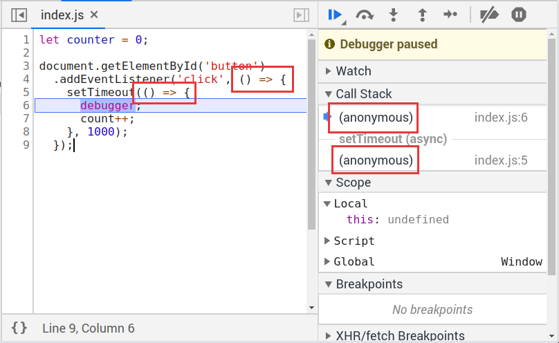
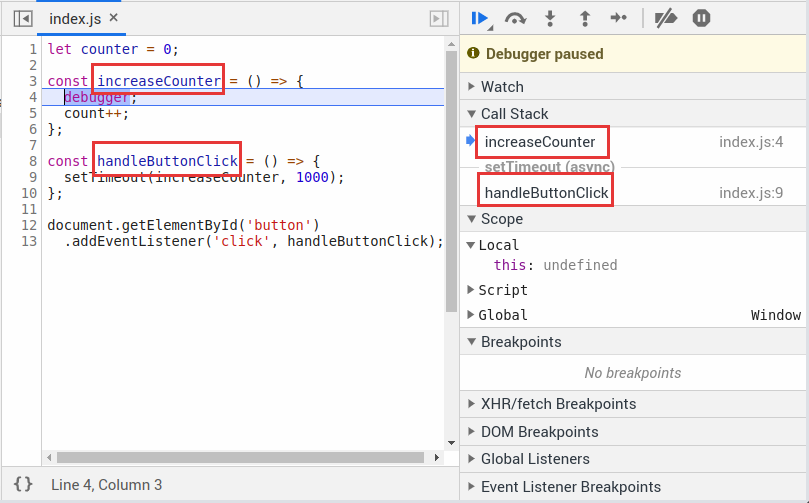

The arrow function deserves the popularity. Its syntax is concise, binds `this` lexically, fits great as a callback. 

In this post, you'll read 5 best practices to get even more benefits from the arrow functions. 

## 1. Arrow function name inference

The arrow function in JavaScript is *anonymous*: the `name` property of the function is an empty string `''`.  

```javascript
( number => number + 1 ).name; // => ''
```

The anonymous functions are marked as `anonymous` during a debug session or call stack analysis. Unfortunately, `anonymous` gives no clue about the code being executed. 

Here's a debug session of a code that executes anonymous functions: 



The call stack on the right side consists of 2 functions marked as `anonymous`. You can't get anything useful from such call stack information.  

Fortunately, the *function name inference* (a feature of ES2015) can [detect](https://stackoverflow.com/a/58983095/1894471) the function name under certain conditions. The idea of name inference is that JavaScript can determine the arrow function name from its syntactic position: e.g. from the variable name that holds the function object.  

Let's see how function name inference works:

```javascript
const increaseNumber = number => number + 1;

increaseNumber.name; // => 'increaseNumber'
```

Because the variable `increaseNumber` holds the arrow function, JavaScript decides that `'increaseNumber'` could be a good name for that function. Thus the arrow function receives the name `'increaseNumber'`.  

> A good practice is to use function name inference to name the arrow functions.

Now let's check a debug session with code that uses name inference:



Because the arrow functions have names, the call stack gives more information about the code being executed: 

- `handleButtonClick` function name indicates that a click event had happened
- `increaseCounter` increases a counter variable.  

## 2. Inline when possible

An inline function is a function that has only one expression. I like about arrow functions the ability to compose short inline functions. 

For example, instead of using the long form of an arrow function:

```javascript
const array = [1, 2, 3];

array.map((number) => { 
  return number * 2;
});
```

You could easily remove the curly braces `{ }` and `return` statement when the arrow function has one expression:

```javascript
const array = [1, 2, 3];

array.map(number => number * 2);
```

Here's my advice:

> When the function has one expression, a good practice is to inline the arrow function.

## 3. Fat arrow and comparison operators

The comparison operators `>`, `<`, `<=` and `>=` look similar to the fat arrow `=>` (which defines the arrow function). 

When these comparison operators are used in an inline arrow function, it creates some confusion.

Let's define an arrow function that uses `<=` operator:

```javascript
const negativeToZero = number => number <= 0 ? 0 : number;
```

The presence of both symbols `=>` and `<=` on the same line is misleading.  

To distinguish clearly the fat arrow from the comparison operator, the first option is to wrap the expression into a pair of parentheses:

```javascript
const negativeToZero = number => (number <= 0 ? 0 : number);
```

The second option is to deliberately define the arrow function using a longer form:

```javascript
const negativeToZero = number => {
  return number <= 0 ? 0 : number;
};
```

These refactorings eliminate the confusion between fat arrow symbol and comparison operators. 

> If the arrow function contains the operators `>`, `<`, `<=` and `>=`, a good practice is to wrap the expression into a pair of parentheses or deliberately use a longer arrow function form.  

## 4. Constructing plain objects

An object literal inside an inline arrow function triggers a syntax error:

```javascript
const array = [1, 2, 3];

// throws SyntaxError!
array.map(number => { 'number': number });
```

JavaScript considers the curly braces a code block, rather than an object literal.  

Wrapping the object literal into a pair of parentheses solves the problem:

```javascript
const array = [1, 2, 3];

// Works!
array.map(number => ({ 'number': number }));
```

If the object literal has lots of properties, you can even use newlines, while still keeping the arrow function inline:

```javascript
const array = [1, 2, 3];

// Works!
array.map(number => ({
  'number': number
  'propA': 'value A',
  'propB': 'value B'
}));
```

My recommendation:

> Wrap object literals into a pair of parentheses when used inside inline arrow functions.  

## 5. Be aware of excessive nesting

The arrow function syntax is short, which is good. But as a side effect, it could be cryptic when many arrow functions are nested.  

Let's consider the following scenario. When a button is clicked, a request to server starts. When the response is ready, the items are logged to console: 

```javascript
myButton.addEventListener('click', () => {
  fetch('/items.json')
    .then(response => response.json())
    .then(json => {
      json.forEach(item => {
        console.log(item.name);
      });
    });
});
```

The arrow functions are 3 levels nesting. It takes effort and time to understand what the code does. 

To increase readability of nested functions, the first approach is to introduce variables that each holds an arrow function. The variable should describe concisely what the function does (see [arrow function name inference](#1-arrow-function-name-inference) best practice). 

```javascript
const readItemsJson = json => {
  json.forEach(item => console.log(item.name));
};

const handleButtonClick = () => {
  fetch('/items.json')
    .then(response => response.json())
    .then(readItemsJson);
};

myButton.addEventListener('click', handleButtonClick);
```

The refactoring extracts the arrow functions into variables `readItemsJson` and `handleButtonClick`. The level of nesting decreases from 3 to 2. Now, it's easier to understand what the script does.  

Even better you could refactor the entire function to use `async/await` syntax, which is a great way to solve the nesting of functions: 

```javascript
const handleButtonClick = async () => {
  const response = await fetch('/items.json');
  const json = await response.json();
  json.forEach(item => console.log(item.name));
};

myButton.addEventListener('click', handleButtonClick);
```

Resuming:

> A good practice is to avoid excessive nesting of arrow functions by extracting them into variables as separate functions or, if possible, embrace `async/await` syntax.  

## 6. Conclusion

The arrow functions in JavaScript are anonymous. To make debugging productive, a good practice is to use variables to hold the arrow functions. This allows JavaScript to infer the function names.  

An inline arrow function is handy when the function body has one expression. 

The operators `>`, `<`, `<=` and `>=` look similar to the fat arrow `=>`. Care must be taken when these operators are used inside inline arrow functions. 

The object literal syntax `{ prop: 'value' }` is similar to a code of block `{  }`. So when the object literal is placed inside an inline arrow function, you need to wrap it into a pair of parentheses: `() => ({ prop: 'value' })`.  

Finally, the excessive nesting of functions obscures the code intent. A good approach to reduce the arrow functions nesting is to extract them into variables. Alternatively, try to use even better features like `async/await` syntax. 

*What's your favorite coding best practices? Leave a comment below!*