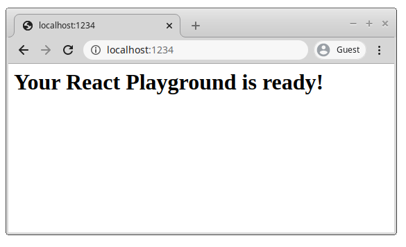
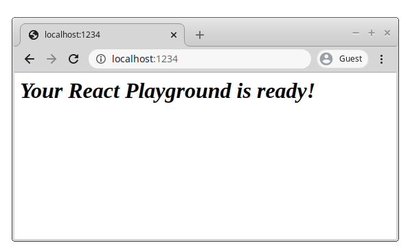

It's natural to learn new things playing and having fun. Children, kittens, puppies explore the world playing.  

The same approach is useful in programming. If you'd like to try new React features, explore an idea, implement a simple demo, then you need a playground.  

In this post, I will show you how to setup a React playground with almost zero configuration in 3 easy steps (using [parcel](https://parceljs.org/) bundler).  

## 1. Step 1: install parcel

The first step is one command: install globally the parcel bundler (I'm using the version `1.12.4`).  

Run the command to install the parcel bundler using npm:

```bash
npm install -g parcel-bundler
```

or if you use yarn:

```bash
yarn global add parcel-bundler
```

The next step is to create the source files.  

## 2. Step 2: create source files

You need to create the playground directory and place there 2 files: the HTML code and the React code.  

I will name the directory `react-playground`, but you can choose your own. Let's create the new directory and enter into it:

```bash
mkdir react-playground && cd react-playground
```

Now, being inside the `react-playground` directory, let's create 2 source files.  

The first file `index.jsx` contains the React code:

```jsx
// index.jsx
import React from 'react';
import ReactDOM from 'react-dom';

function App() {
  return <h1>Your React Playground is ready!</h1>;
}

ReactDOM.render(
  <App />,
  document.getElementById('root')
);
```

The second file `index.html` contains the HTML code (the script tag links to `./index.jsx` file):

```html
<!-- index.html -->
<html>
<body>
  <div id="root"></div>
  <script src="./index.jsx"></script>
</body>
</html>
```

After creating the directory and files, your playground has the following items:

```html
react-playground
  ├── index.html
  └── index.jsx
```

## 3. Step 3: run parcel

After the files `index.html` and `index.jsx` have been created in your playground's directory, simply run the build command:

```bash
parcel index.html
```

What a bit until parcel automatically installs the dependencies (`react`, `react-dom`, etc) and builds the playground. Finally, when the building has been completed, your playground is available at [http://localhost:1234](http://localhost:1234). Have fun!



You can start making changes to your playground right away. As soon as you change the source files, `parcel` automatically rebuilds the application, then updates the web page. Pretty cool!

If your playground needs more libraries, you don't have to install them manually. Simply require the needed library using `import` syntax, and `parcel` automatically installs the required dependencies.  

Note that `parcel` installs the latest stable dependencies at the time of running the build command. But you can [customize](#42-specific-versions-of-dependencies) the dependencies versions.  

## 4. Customizations

Let's see the common customizations you'd possibly need.

### 4.1 Add CSS

Adding styles to your local playground application is easy.  

First, create the file `styles.css` in your playground project directory:

```css
/* styles.css */
h1 {
  font-style: italic;
}
```

Secondly, update the `index.html` to link to the new external CSS file:

```html{3-5}
<!-- index.html -->
<html>
<head>
  <link rel="stylesheet" href="./styles.css">
</head>
<body>
  <div id="root"></div>
  <script src="./index.jsx"></script>
</body>
</html>
```

Without any further configuration, `parcel` picks the CSS file and applies it. Any change to the stylesheets triggers a rebuild and web page update. Great.



### 4.2 Specific versions of dependencies

By default, `parcel` installs the latest stable dependencies. But you can easily customize the dependencies versions.  

After the first build, `parcel` generates a `package.json` file in the playground directory: 

```html{4}
react-playground
  ├── index.html
  ├── index.jsx
  └── package.json
```

To install a specific dependency version, for example of React and React DOM, simply update `package.json`:

```json{4-5}
// package.json
{
  "dependencies": {
    "react": "16.12.0",
    "react-dom": "16.12.0"
  }
}
```

### 4.3 TypeScript support

Rename the React source file to `index.tsx` (`.tsx` extension instead of `.jsx`), and `parcel` automatically enables the support of TypeScript.  

Create a file `index.tsx` having some TypeScript code:

```tsx
// index.tsx
import * as React from 'react';
import * as ReactDOM from 'react-dom';

function App(): JSX.Element {
  return <h1>Your React Playground is ready!</h1>;
}

ReactDOM.render(
  <App />,
  document.getElementById('root')
);
```

Then update the HTML file so that the `script` tag to point to `index.tsx` file:

```html{5}
<!-- index.html -->
<html>
<body>
  <div id="root"></div>
  <script src="./index.tsx"></script>
</body>
</html>
```

Finally, install the React types modules:

```bash
npm install --save-dev @types/react @types/react-dom
```

Now your playground has TypeScript support. The editor should start type checking.  

## 5. Conclusion

Playgrounds are a great way to play with the new features of React, test ideas, wire up a quick demo. If you prefer to have all your source code locally, then using parcel is a good start.  

To setup a local React playground 3 easy steps are needed. Install parcel bundler globally, create your project directory with 2 source files: the HTML and React source files. Finally, just run the `parcel` build command. The playground is ready!

If for some reason you don't like `parcel`, an alternative is the known [react-create-app](https://github.com/facebook/create-react-app). If you don't like local playgrounds, I have had a good experience with [codesandbox.io](https://codesandbox.io/).  

Happy playing!