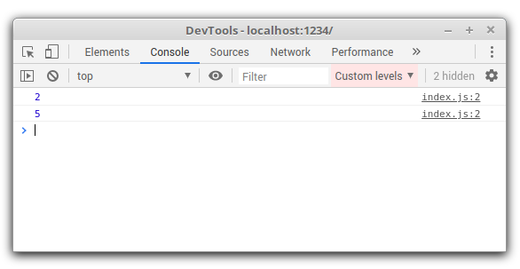
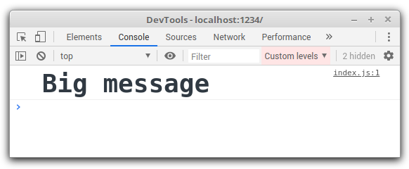
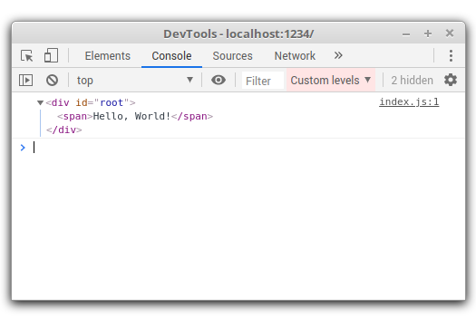
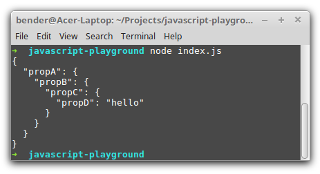

The first tool in debugging JavaScript code is the `console.log()` logging function. 

Its usage is simple. The argument on function invocation is logged to console:

```javascript
// Log a message
console.log('My message');

const myVar = 13;
// Log a variable
console.log(myVar);
```

This post suggests 5 useful tips that will make you even more productive when using `console.log()`.

## 1. Naming logged variables

When you'd like to log many variables in different places of the application, you may find difficult to understand to what log corresponds to a specific variable.  

Let's log some variables:

```javascript{2}
function sum(a, b) {
  console.log(b);
  return a + b;
}

sum(1, 2);
sum(4, 5);
```

When the above code is executed, you'll see just a series of numbers:



To make an association between the logged value and variable, an easy approach is to wrap the variable into a pair of curly braces `{ b }`:

```javascript{2}
function sum(a, b) {
  console.log({ b });
  return a + b;
}

sum(1, 2);
sum(4, 5);
```

The variable `b` is wrapped into curly braces `console.log({ b })` when being logged.  

Now looking at the console, it's easy to understand that exactly variable `b` is being logged:


## 2. Advanced formatting

The most common way to log something to console is to simply call `console.log()` with one argument:

```javascript
console.log('My message');
// logs "My message"
```

Sometimes you might want a message containing multiple variables. Fortunately, `console.log()` can format the string in a `sprintf()` way using a list of specifiers.   

For example, let's format and then log a message:

```javascript
const user = 'john_smith';
const attempts = 5;

console.log('%s failed to login %i times', user, attempts);
// logs "john_smith failed to login 5 times"
```

`%s` and `%i` are replaced with values of `user` and `attempts`. The specifier `%s` is converted to a string, while `%i` is converted to a number.  

Here's a list of available specifiers:

| Specifier    |    Purpose                                                        |
|--------------|-------------------------------------------------------------------|
| `%s`         |  Element is converted to a string                                 |
| `%d` or `%i` |  Element is converted to an integer                               |
| `%f`         |  Element is converted to a float                                  |
| `%o`         |  Element is displayed with optimally useful formatting            |
| `%O`         |  Element is displayed with generic JavaScript object formatting   |
| `%c`         |  Applies provided CSS                                             |


## 3. Log with style

Browser console implementation lets you apply styles to the message that is sent to the console.  

You can do this by using the `%c` specifier with the corresponding styles. For example, let's a log message with increased font size and font weight:

```javascript
console.log('%c Big message', 'font-size: 36px; font-weight: bold');
```

The specifier `%c` applies the CSS styles `'font-size: 36px; font-weight: bold'`.

Here's how the log message with applied styles looks in Chrome console:



## 4. Interactive logs

The implement of how the console styles the logged messages depends on the host implementation. The browsers like Chrome and Firefox offer interactive logs of objects and arrays, while Node console is usually text-based only.  

Let's see how Chrome logs the plain objects, arrays and DOM trees. When displayed in the console, you can interact with these elements with expanding and collapsing.  

### 4.1 Objects

```javascript
const myObject = {
  name: 'John Smith',
  profession: 'agent'
};

console.log(myObject);
```

In Chrome console the log of `myObject` looks like:


You can expand and collapse the list of object properties. As well you can see the prototype of the object.  

### 4.2 Arrays

```javascript
const characters = ['Neo', 'Morpheus', 'John Smith'];

console.log(characters);
```

Chrome logs the `characters` array as follows:


### 4.3 DOM trees

You can interact directly with a DOM element that is displayed in the console.  

```javascript
console.log(document.getElementById('root'));
```

In Chrome console, the DOM element can be expanded and its content can be explored in full:



### 4.4 Interactive log inside messages

Using the `%o` specifier (which associates the right log formatting for the value), you can combine arrays, objects, DOM elements, and regular text into a single log, without losing the interactivity.  

The following invocation logs a message which has inside an object:

```javascript
const myObject = {
  name: 'John Smith',
  profession: 'agent'
};

console.log('Neo, be aware of %o', myObject);
```

Looking now at the console, the `myObject` array wasn't converted into a string representation, but rather is kept interactive.  


## 5. Logging big objects in Node console

The logs in Node are normally output as plain text. 

But there is a small issue: `console.log()` in Node doesn't display objects with a deep level of nesting. The deep objects after level 3 are shown as `[Object]`.

For example, let's log the following object:

```javascript
const myObject = {
  propA: {
    propB: {
      propC: {
        propD: 'hello'
      }
    }
  }
};

console.log(myObject);
```

When running the above script, the following content is logged:


To be able to see the full object structure is to use the `JSON.stringify()` function:

```javascript
const myObject = {
  propA: {
    propB: {
      propC: {
        propD: 'hello'
      }
    }
  }
};

console.log(JSON.stringify(myObject, null, 2));
```

`JSON.stringify(myObject, null, 2)` returns a JSON representation of the object. The third argument `2` sets the indent size in spaces.  

Now the object is logged in full:



Hopefully, the 5 tips presented above will make your debugging and logging experience in JavaScript more productive.  

*Please share your logging tips in a comment below!*