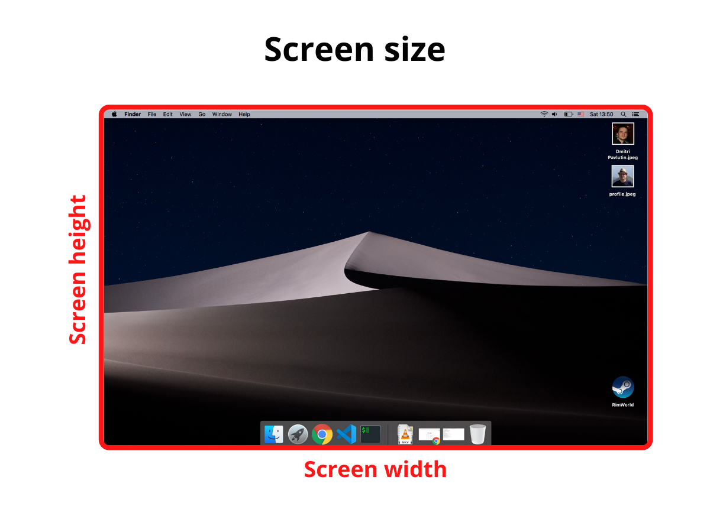
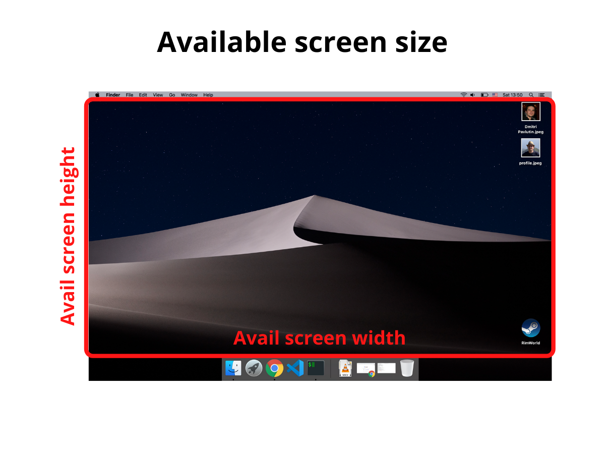
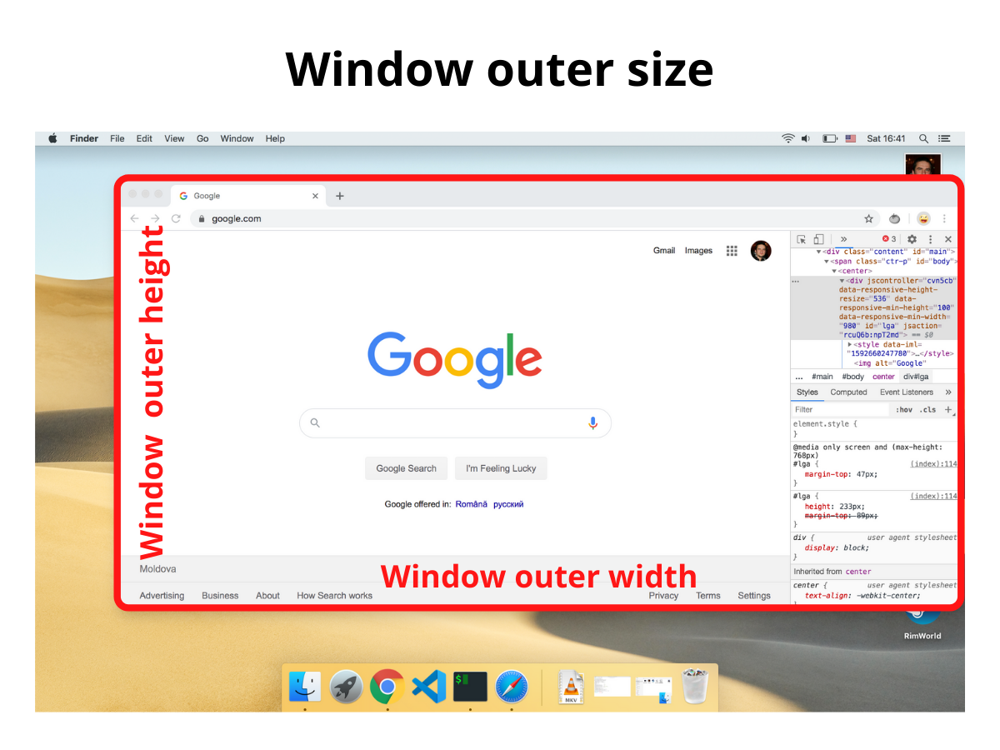

To detect whether the browser window is in landscape or portrait mode, one way to find out this information is to compare the window's width and height.  

To determine the device orientation you need to access the window width's and height.  

From my personal experience, it's easy to get confused in the whole bunch of sizes that you have to deal with: screen, window, web page sizes. 

How exactly are these sizes defined, and, importantly, how to access them is what I'm going to discuss with you.  

## 1. The screen

### 1.1 The screen size

The screen size consists of the width and height of the active screen: the monitor (in case of a desktop or laptop OS), or the mobile screen (in case of a mobile device).  

### 1.2 The available screen size

 

## 2. The window

### 2.1 The window inner size

### 2.2 The window outer size

## 3. The web page size