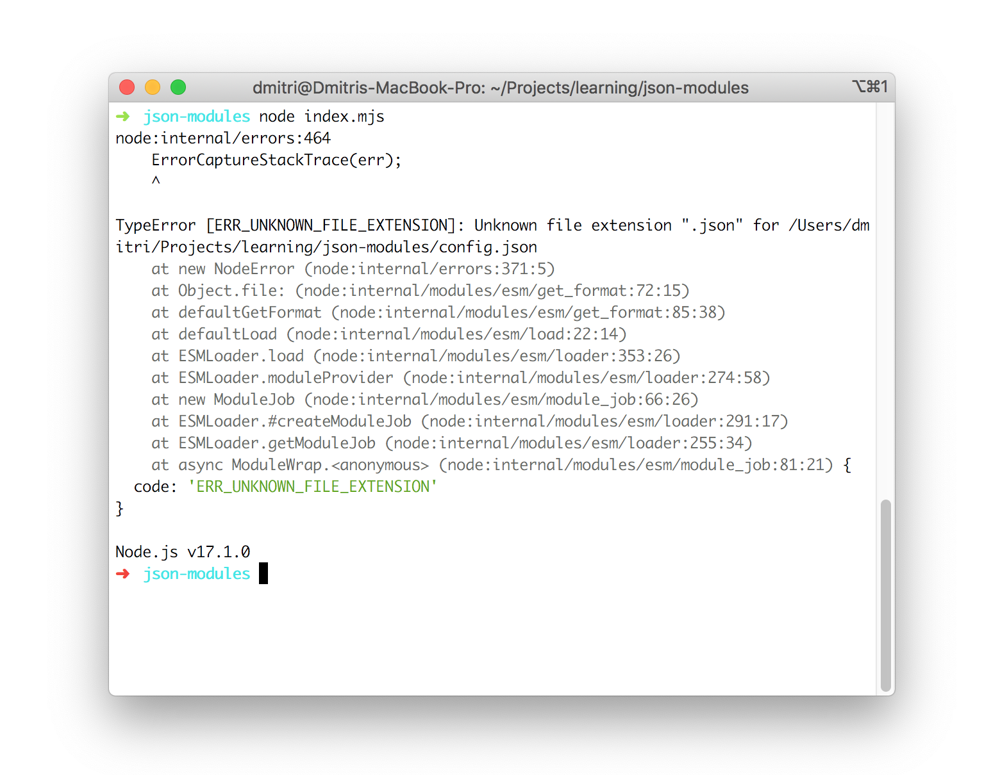

The ECMAScript modules system (`import` and `export` keywords) by default can import only JavaScript code of another module.  

What if you'd like to import data from a JSON file? It's often convenient to keep an application's configuration inside of a JSON file.  

For a long time, importing JSON is supported by commonjs modules format.  

Fortunately, a new proposal at stage 3 named [JSON modules](https://github.com/tc39/proposal-json-modules) proposes a way to import JSON into an ES module. Let's see how JSON modules work.

## 1. Importing config.json

You have a simple JSON file named `config.json` that contains useful config values of an application: the name and the current version.  

```json
{
  "name": "My Application",
  "version": "v1.2"
}
```

How to import `config.json` into an ES module?  

For example, let's create a simple web application that renders the application name and version from the JSON configuration file.  

If you'd try to import `config.json` directly, Node.js would throw an error:

```javascript{1}
import http from 'http';
import config from './config.json';

http
  .createServer((req, res) => {
    res.write(`App name: ${config.name}`);
    res.write(`App version: ${config.version}`);
    res.end();
  })
  .listen(8080);
```

When trying to run the application, Node.js throws an error `TypeError [ERR_UNKNOWN_FILE_EXTENSION]: Unknown file extension ".json"`.  



That's expected because Node.js expects JavaScript code inside any imported module.  

Before fixing the application, let's see in a few sentences what JSON module proposal is.   

## 2. JSON modules proposal

The essence of the [JSON modules proposal](https://github.com/tc39/proposal-json-modules) is to allow importing JSON data inside of an ES module using a regular `import` statement.  

To import a JSON file as a module you need to use a so called import assertion right after the `import` statement:

```javascript
import jsonContent from "./file.json" assert { type: "json" };
```

where `assert { type: "json" }` is an import assertion indicating the module should be parsed and imported as JSON.  

`jsonContent` variable contains the plain JavaScript object that's created after parsing the content of `file.json`.  

The content of a JSON module is imported using a default import. Named imports are not available.  

A JSON module can also be imported dynamically:

```javascript
const jsonContent = await import('./file.json', {
  assert: {
    type: 'json'
  }
});
```

The import assertion in this particular case indicates a JSON type. However, there's a more general proposal [import assertions](https://github.com/tc39/proposal-import-assertions/) (currently at stage 3) that allows importing more data formats, like CSS modules.  

## 3. Enabling JSON modules

Now, let's integrate JSON module into the web application:

```javascript{1}
import http from 'http';
import config from './config.json' assert { type: "json" };

http
  .createServer((req, res) => {
    res.write(`App name: ${config.name}`);
    res.write(`App version: ${config.version}`);
    res.end();
  })
  .listen(8080);
```

The main module can import the `config.json` file, and access its value `config.name` and `config.version`.  


JSON modules work in Node.js version `>=17.1`, also by using `--experimental-json-modules` flag to enable [Experimental JSON modules](https://nodejs.org/api/esm.html#esm_experimental_json_modules):

```bash
node --experimental-json-modules index.mjs
```

In a browser environment, the JSON modules are available starting Chrome 91.  

## 4. Conclusion

By default, an ES module can import only JavaScript code.  

Thanks to the JSON modules proposal you can import JSON content directly into an ES module. This is done by using an import assertion right after the import statement:  

```javascript
import jsonContent from "./file.json" assert { type: "json" };
```

You can use JSON modules starting Node.js 17.1 with the experimental flag `--experimental-json-modules` and in Chrome 91 and above.   