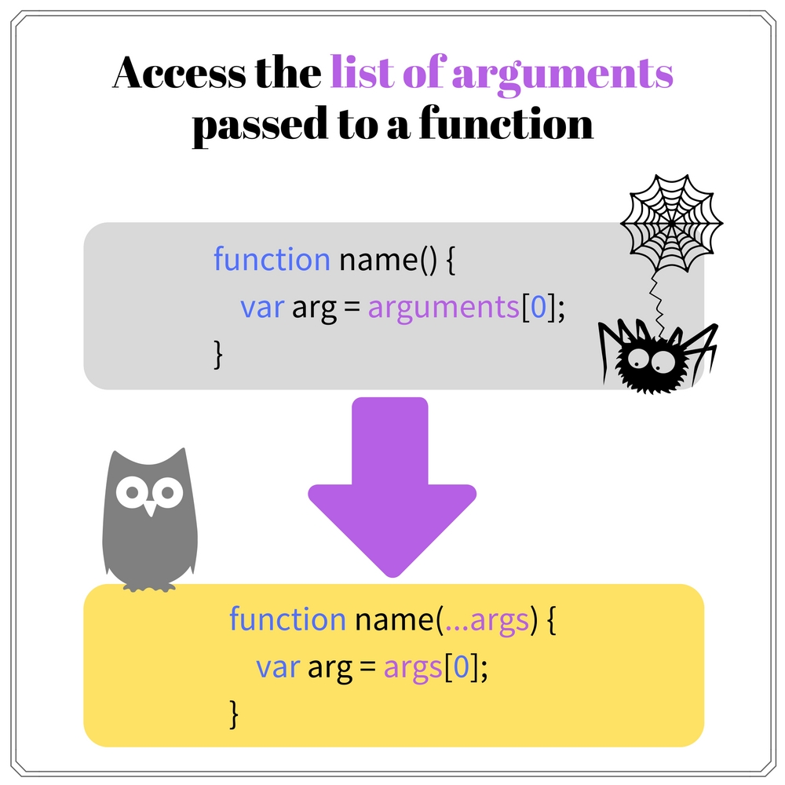
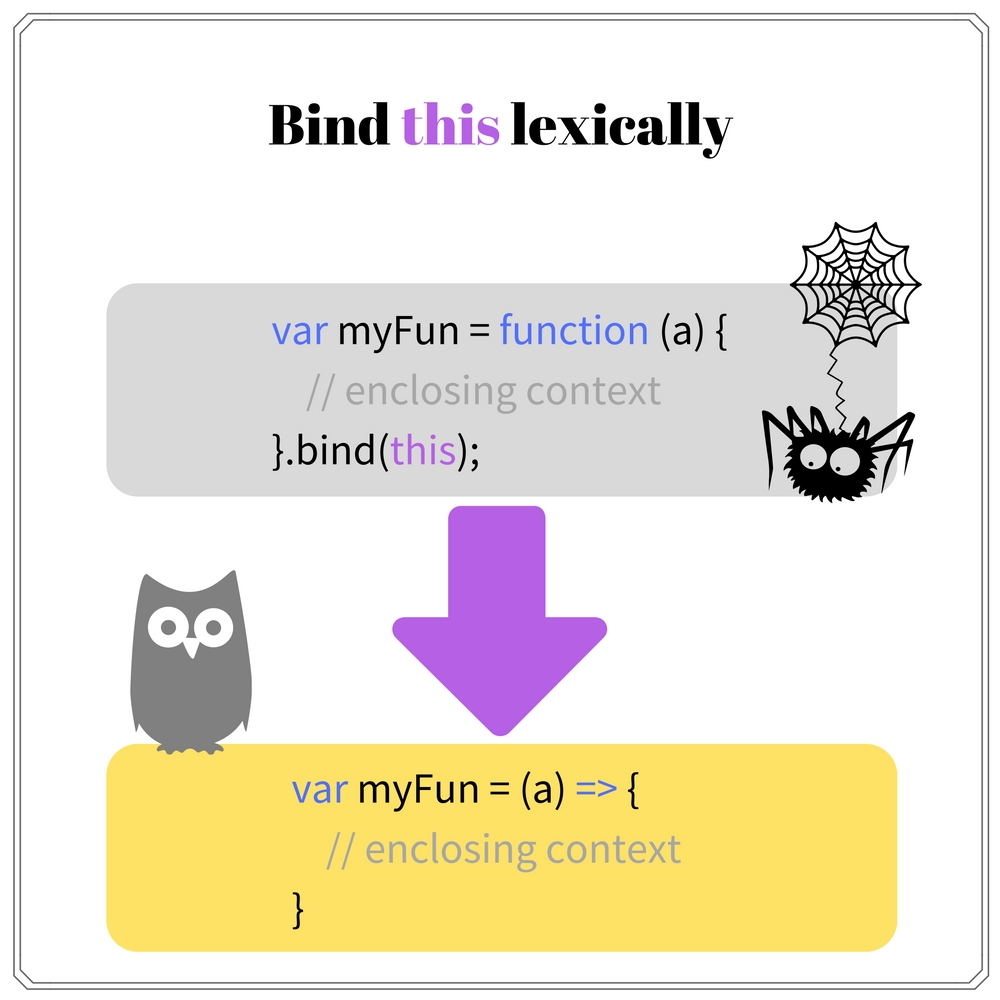
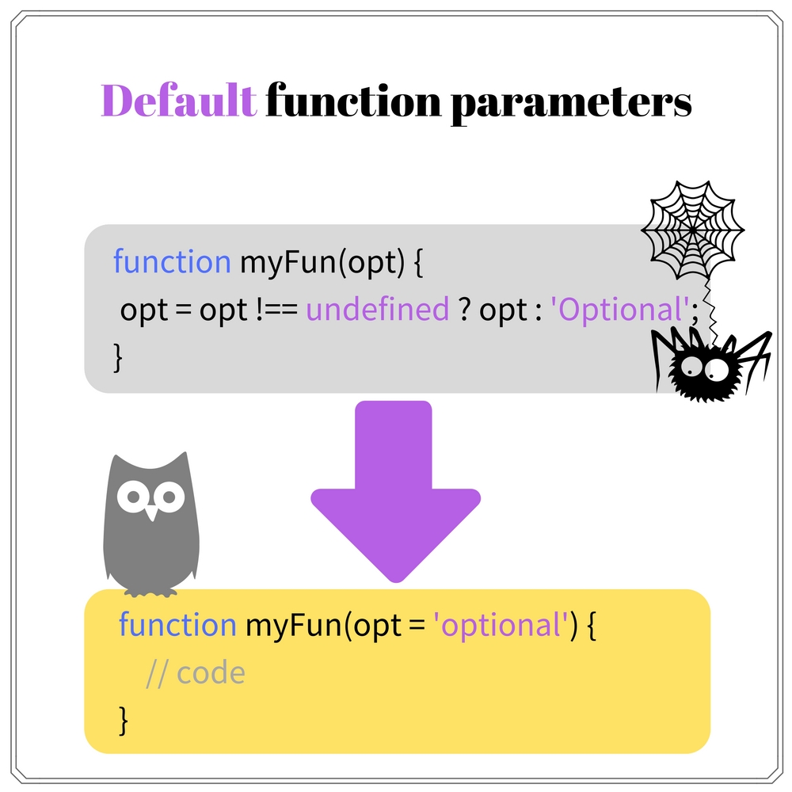

It's known that before ECMAScript 2015 JavaScript language was tricky. 
For simple scripts [ES5](http://www.ecma-international.org/ecma-262/5.1/) code works fine. But as soon as the application complexity grows, you start to feel that the lack of language constructs is making your code unpleasant.  

Because you have to implement the application requirements, you can't jump over the parts of code that are troublesome to implement in ES5 style. The possible solution, yet not reasonable, is [to start using hacks](https://blog.jscrambler.com/12-extremely-useful-hacks-for-javascript/).  

In the long term code with hacks and workarounds creates a lot of problems. Especially it becomes harder to read and maintain, not even talking about the aesthetic pleasure.  

And as a general rule:  
> Applying JavaScript hacks is building a house of cards.  


An alternative is the usage of utility libraries, like [Underscore](http://underscorejs.org/) or [lodash](https://lodash.com/). They offer a variety of functions that makes easier to solve a part of the difficulties.  
They are better, but still workarounds. You have to keep additional dependencies and may not always find the necessary constructs.  

ECMAScript 2015, 2016 and soon 2017 are making effective steps to improve the situation. Already now a big part of the hacks can be easily migrated to more suitable alternatives: native and stable. And you should start the improvement process in your project too.   

How to build a rock solid & shining JavaScript code? Follow this guide on how to knockout hacks from your code and apply comprehensible solutions. 
Plus a bit of positive irony.  

## 1. Verify the element existence in an array

> Searching for an element using `array.indexOf(element) !== -1` breaks my heart.

Since every application deals with arrays, it's a common task to verify if an element exists within a collection.  

In ES5 the usual solution was to use `Array.prototype.indexOf(element, [fromIndex])` method and verify the returned value to be different than `-1`, which indicates the missing element. 

Such verification is using a side effect of the `.indexOf()` method, because it normally returns the index of an element in array, and simply `-1` when its not found.  

Let's see a sample:  

```javascript
var months = ['January', 'March', 'July'];
months.indexOf('March') !== -1;  // => true
months.indexOf('August') !== -1; // => false
```
To verify if an elements exists in `months` array, `months.indexOf()` should return a value different than `-1`.  
For an existing element `months.indexOf('March')` the method returns the index `1`, so the comparison `1 !== -1` is `true`. `'March'` element exists.
Calling `months.indexOf('August')` is evaluated to `-1`, which indicates that the element is missing: `-1 !== -1` is `false`. `'August'` element does not exist.

Even worse you may encounter other ways of comparison:

* `months.indexOf('March') != -1` 
* `months.indexOf('Match') < 0`
* `~months.indexOf('March')`
* and so on...

Such way to search elements is not convenient and smells like a hack.  

To pass this problem, ECMAScript 2016 introduces a [new method](/must-know-details-about-es2016-features/#1-the-array-method-includes) `Array.prototype.includes(element, [fromIndex])`. It returns a boolean that indicates the existence of `element` in array.  


Let's improve the above example:

```javascript
var months = ['January', 'March', 'July'];
months.includes('March');  // => true
months.includes('August'); // => false
```
For an existing element, `months.includes('March')` returns `true`, and for a non-existing `months.includes('August')` a `false` boolean.

Simple and coherent! Surely `.indexOf(element) !== -1` must be replaced with `.includes(element)`.  

The availability of `Array.prototype.includes(element, [fromIndex])`:

<table>
<tr>
  <td>
    <i>Standard</i>
  </td>
  <td>
    <a href="http://ecma-international.org/ecma-262/7.0/#sec-array.prototype.includes">ECMAScript 2016</a>
  </td>
</tr>
<tr>
  <td>
    <i>Browsers/runtime support</i>
  </td>
  <td>
    Chrome 41+, Firefox 40+, Safari 9+, Edge 14+, Node 6+
  </td>
</tr>
<tr>
  <td>
    <i>Babel polyfill</i>
  </td>
  <td>
    <a href="https://github.com/stoeffel/babel-plugin-array-includes">Plugin array includes</a>
  </td>
</tr>
</table>


## 2. Access the list of arguments passed to a function

> `arguments` makes you feel the taste of hardcoding

`arguments` is an object that contains the list of arguments that were passed to function on invocation.

In my opinion, `arguments` object is a hardcoded construct with a series of limitations:

* `arguments` is an [array-like object](http://www.2ality.com/2013/05/quirk-array-like-objects.html), so it is not possible directly to use array methods like `.forEach()`, `.reduce()`, etc
* The variable name of `arguments` cannot be changed, for example to `args`
* Every function scope defines its own `arguments`. Accessing `arguments` of an outer function from an inner function requires additional temporary variable `var outerArgs = arguments`
* Inconsistency between function signature `function myFun() {}` and `arguments` usage. A function signature may indicate that function does not have parameters, but suddenly in the code you may encounter `arguments` object. 

Let's take a look at an example:

```javascript
function sum() {
  return Array.prototype.reduce.call(arguments, function(sum, el) {
    return sum + el;
  });
}
sum(10, 5, 2); // => 17
```
`sum()` function returns the sum of arguments. As described in the list of limitations above, `arguments` is an array-like object. So an indirect call of `.reduce()` method is necessary.  
The function signature `function sum() {}` indicates that it does not have any parameters, however in the body `arguments` accesses the values passed on invocation. This creates confusion, because the signature should clearly indicate what parameters the function accepts, without the necessity to dive into the implementation details.  

Almost all of these limitation are solved by [rest parameters](/how-three-dots-changed-javascript/#2-improved-parameters-access) `function funName(...restParam)`, available in ECMAScript 2015.  



The rest parameter is present in the function signature as a regular parameter, only prefixed by three dots `...`. The rest parameter puts into an array the arguments passed to function on invocation. And as any other parameter, it can be named accordingly to its meaning.  

Let's get rid of `arguments` object from the above example and use a rest parameter:

```javascript
function sum(...numbers) {
  return numbers.reduce(function(sum, el) {
    return sum + el;
  });
}
sum(10, 5, 2); // => 17
```
`numbers` rest parameter contains an array of arguments `[10, 5, 2]` that function `sum(10, 5, 2)` was invoked with.  
The problems specific to `arguments` object are now solved:

* `numbers` can call `.reduce()` array method
* It is possible to name the variable according to its meaning, in our case as an array of numbers
* The function signature `function sum(...numbers)` obviously indicates that arguments list is going into `numbers` parameter.

Without considerable amount of refactoring, but for a considerable code readability `arguments` object should be migrated to rest parameters.  

The availability of the rest parameters:

<table>
<tr>
  <td>
    <i>Standard</i>
  </td>
  <td>
    <a href="http://www.ecma-international.org/ecma-262/6.0/#sec-function-definitions">ECMAScript 2015</a>
  </td>
</tr>
<tr>
  <td>
    <i>Browsers/runtime support</i>
  </td>
  <td>
    Chrome 47+, Firefox 15+, Safari 10+, Edge 13+, Node 6+
  </td>
</tr>
<tr>
  <td>
    <i>Babel transform</i>
  </td>
  <td>
    <a href="http://babeljs.io/docs/plugins/transform-es2015-parameters/">ES2015 parameters transform</a>
  </td>
</tr>
</table>

## 3. Bind this lexically

> `this` is a small word that makes a big headache.

`this` or the function invocation context is a difficult part of JavaScript. I recommend you to read [my definitive guide to understanding `this`](/gentle-explanation-of-this-in-javascript/).  

Regular JavaScript functions have `this` depending on the invocation type. In case of a regular invocation `myFunction()`, `this` is `window` object or `undefined` in strict mode.  

Often is necessary that a function to have `this` as the enclosing context, without defining its own `this` as happens by default. In order to modify the invocation context JavaScript provides special methods and one additional trick: 

* Using an indirect call `Function.prototype.call(context, arg1, ...)` or `Function.prototype.apply(context, [arg1, ...])`
* Creating a bound function `Function.prototype.bind(context, arg1, ...)`
* Store the enclosing context into a separated variable `var context = this` to access it in the inner function

To keep the same context in the inner function, the usage of these methods is tricky and verbose.  
I never liked to attach to every function expression an additional tail `.bind(this)`, neither to create context spaghetti by storing `this` in a separated variable `var self = this`.

Let's see a typical situation:

```javascript
function Numbers(array, operation) {
  this.array = array;
  this.operation = operation;
  this.calculate = function() {
    return this.array.reduce(function(accumulator, element) {
      if (this.operation === 'sum') {
        return accumulator + element;
      } else if (this.operation === 'multiply') {
        return accumulator * element;
      }
      throw new Error('Unknown operator');
    }.bind(this)); // <--- bind the function context
  }  
}
var myNumbers = new Numbers([1, 5, 10], 'sum');
myNumbers.calculate(); // => 16
```

`Numbers` constructor calculates the sum or multiplication of elements in an array.  
The constructor provides `.calculate()` method, which uses `this.array.reduce()` to apply the necessary operation. The callback function is bound with the enclosing context `function(accumulator, element) {...}.bind(this)`, to access `this.operation` correctly.  

The [arrow function](/6-ways-to-declare-javascript-functions/#4-arrow-function) allows efficiently to bind `this` lexically. It uses the enclosing context and does not define its own `this`.  



Let's see how the code gets better when applying an arrow function:

```javascript
function Numbers(array, operation) {
  this.array = array;
  this.operation = operation;
  this.calculate = function() {
    return this.array.reduce((accumulator, element) => {
      if (this.operation === 'sum') {
        return accumulator + element;
      } else if (this.operation === 'multiply') {
        return accumulator * element;
      }
      throw new Error('Unknown operator');
    });
  }  
}
var myNumbers = new Numbers([1, 5, 10], 'sum');
myNumbers.calculate(); // => 16
```

Now the `this.array.reduce()` uses an arrow function as a callback.  
The arrow function has `this` as the `this.calculate()` method context (a `Numbers` constructor instance), which allows to access correctly `this.operation`.  

As seen, the arrow function provides a shorter syntax and the desired context transparency.  

The arrow function availability:

<table>
<tr>
  <td>
    <i>Standard</i>
  </td>
  <td>
    <a href="http://www.ecma-international.org/ecma-262/6.0/#sec-arrow-function-definitions">ECMAScript 2015</a>
  </td>
</tr>
<tr>
  <td>
    <i>Browsers/runtime support</i>
  </td>
  <td>
    Chrome 45+, Firefox 22+, Safari 10+, Edge 13+, Node 4+
  </td>
</tr>
<tr>
  <td>
    <i>Babel transform</i>
  </td>
  <td>
    <a href="https://babeljs.io/docs/plugins/transform-es2015-arrow-functions/">ES2015 arrow functions transform</a>
  </td>
</tr>
</table>

## 4. Default function parameters

> `param = param !== undefined ?  param: 'Default value'` is the whole story about default function parameters

Many dynamic programming languages have function default parameters feature: [PHP](http://php.net/manual/en/functions.arguments.php#functions.arguments.default), [Ruby](http://ruby-doc.com/docs/ProgrammingRuby/html/tut_methods.html) and [Python](https://docs.python.org/2.7/reference/compound_stmts.html#function-definitions).  

But it wasn't  the JavaScript case: when the argument is not set on invocation, by default it is `undefined`. And that's all. 

To emulate the default params value you had to make additional operations:  

```javascript
function myFun(req, opt) {
  opt = opt !== undefined ? opt : 'optional';
  return req + ' ' + opt;
}
myFun('required'); // => 'required optional'
```
`opt` on function call is not indicated, so it defaults to `undefined`. The ternary operator helps to set the default value: `opt !== undefined ? opt : 'optional'`.  

Well, it works (close enough). But obviously a better solution is necessary.  



Fortunately ES2015 allows to define default function parameters, which solves the problem wonderfully:  

```javascript
function myFun(req, opt = 'optional') {
  return req + ' ' + opt;
}
myFun('required'); // => 'required optional'
```
The function signature `function myFun(req, opt = 'optional')` indicates that `opt` defaults to `'optional'` value. Plain and simple.  

Notice that the default parameters are evaluated when the function is invoked, but **not** when it is defined. If an object is used as a default value, every time on function invocation a new instance is created.  

<table>
<tr>
  <td>
    <i>Standard</i>
  </td>
  <td>
    <a href="http://www.ecma-international.org/ecma-262/6.0/#sec-function-definitions">ECMAScript 2015</a>
  </td>
</tr>
<tr>
  <td>
    <i>Browsers/runtime support</i>
  </td>
  <td>
    Chrome 49+, Firefox 41+, Safari 10+, Edge 14+, Node 6+
  </td>
</tr>
<tr>
  <td>
    <i>Babel transform</i>
  </td>
  <td>
    <a href="https://babeljs.io/docs/plugins/transform-es2015-parameters/">ES2015 parameters transform</a>
  </td>
</tr>
</table>

## 5. Copy properties from source to target object

> How to copy properties to a target object? Include the whole *jQuery* and use `$.extend()`

The missing native way to copy object properties to a target is from my personal *Ouch!*

In ES5 you had to include libraries like lodash or jQuery that provide the extend utility function. Or invent your own bicycle:  

```javascript
function extend() {
  if (arguments.length === 0) {
  	return null;
  }
  var target = arguments[0];
  for (var index = 1; index < arguments.length; index++) {
    for (var key in arguments[index]) {
      if (arguments[index].hasOwnProperty(key)) {
        target[key] = arguments[index][key];
      }
    }
  }
  return arguments[0];
}
var defaults = {
  height: 800,
  width: 200
}
var settings = extend({}, defaults, {
  height: 500
});
settings; // => { height: 500, width: 200 }
```
`extend(target, source1, source2, ...)` function copies the properties from `source1`, `source2`, etc objects into `target` object.  
`settings` object receives properties from `defaults` and `{ height: 500 }` object.  

`Object.assign()` function from ES2015 is designed to implement this requirement. Native, tested and standardized solution.  


Let's see how `Object.assign()` is applied:

```javascript
var defaults = {
  height: 800,
  width: 200
}
var settings = Object.assign({}, defaults, {
  height: 500
});
settings; // => { height: 500, width: 200 }
```

The code didn't change too much, other than `Object.assign()` native function is used to copy object properties. Minus one dependency.  

The `Object.assign()` availability:

<table>
<tr>
  <td>
    <i>Standard</i>
  </td>
  <td>
    <a href="http://www.ecma-international.org/ecma-262/6.0/#sec-object.assign">ECMAScript 2015</a>
  </td>
</tr>
<tr>
  <td>
    <i>Browsers/runtime support</i>
  </td>
  <td>
    Chrome 45+, Firefox 34+, Safari 9+, Edge 13+, Node 4+
  </td>
</tr>
<tr>
  <td>
    <i>Babel transform</i>
  </td>
  <td>
    <a href="https://babeljs.io/docs/plugins/transform-object-assign/">Object.assign transform</a>
  </td>
</tr>
</table>

## 6. It's only the beginning

These are only a part of the hacks that should be eliminated in the long run from existing JavaScript codebase.  

New constructs that provide ECMAScript 2015 and beyond are meant to make JavaScript more readable and extensible.  
If your code has workarounds, without doubt you should migrate them, and get used with the improved JavaScript syntax and features.  

Just make sure that the migration process does not introduce new bugs, because often hacks are difficult to cut. Anyway, a solid base of functional and unit tests would be very helpful.  

I hope from now on `array.indexOf(element) !== -1` will disappear from your code!

*Do you know other hacks that nicely can be knocked out? Write a comment below and let's discuss!*