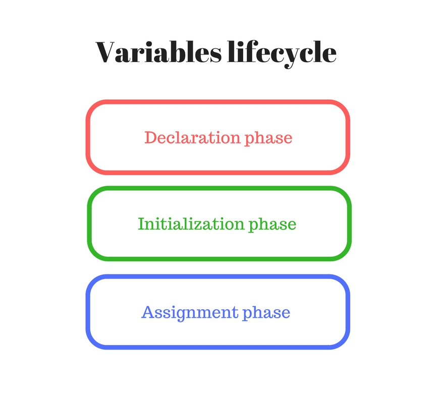
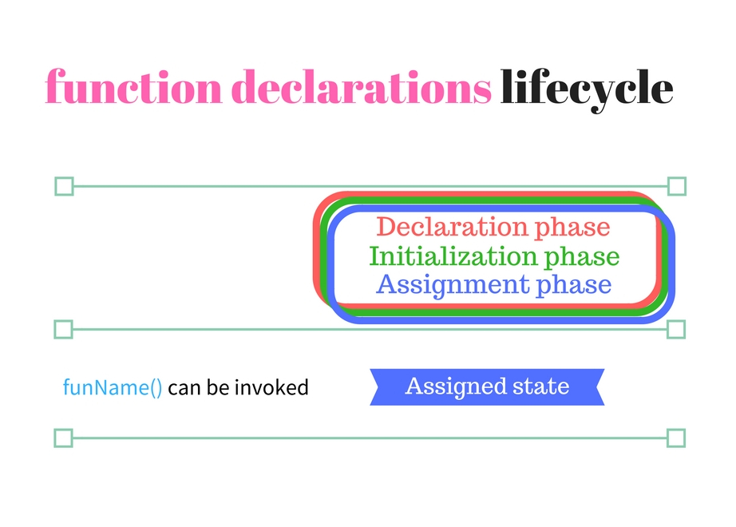
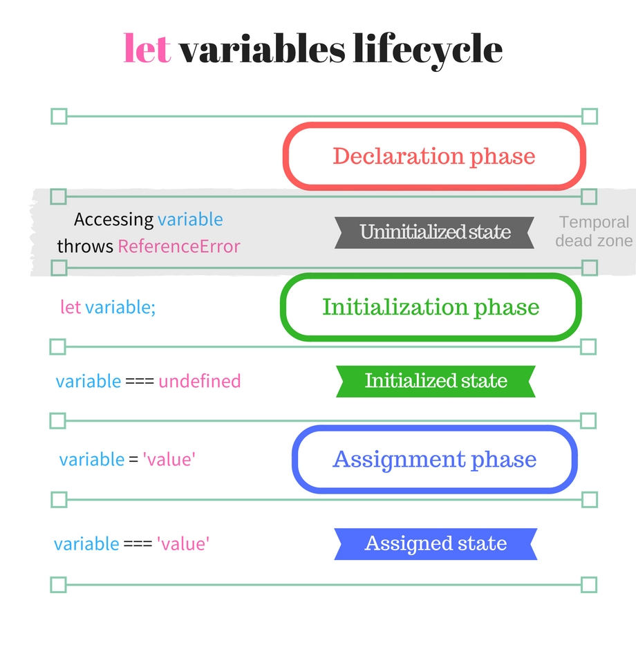

Hoisting is the process of virtually moving the variable or function definition to the beginning of the scope, usually for variable statement `var` and function declaration `function fun() {...}`.  

When `let` (and also `const` and `class`, which have similar declaration behavior as `let`) declarations were introduced by ES2015, many developers including myself were using the *hoisting* definition to describe how variables are accessed. But after more search on the question, surprisingly for me  *hoisting* is not the correct term to describe the initialization and availability of the `let` variables.  

ES2015 provides a different and improved mechanism for `let`. It demands stricter variable declaration practices (you can't use before definition) and as result better code quality.  

Let's dive into more details about this process.  

*Before I go on, let me recommend something to you.* 

*If you want to significantly improve your JavaScript knowledge, take the  amazingly useful course ["Modern JavaScript From The Beginning 2.0"](https://www.traversymedia.com/a/2147528886/FqXWyazh) by Brad Traversy. Use the coupon code "DMITRI" and get up to 20% discount!*

## 1. Error prone var hoisting
Sometimes I see a weird practice of variables `var varname` and functions `function funName() {...}` declaration in any place in the scope:  

```javascript
// var hoisting
num;     // => undefined
var num;
num = 10;
num;     // => 10
// function hoisting
getPi;   // => function getPi() {...}
getPi(); // => 3.14
function getPi() {
  return 3.14;
}
```
The variable `num` is accessed before declaration `var num`, so it is evaluated to `undefined`.
The function `function getPi() {...}` is defined at the end of file. However the function can be called before declaration `getPi()`, as it is hoisted to the top of the scope.  

This is the classical *hoisting*.  

As it turns out, the possibility to first use and then declare a variable or function creates confusion.  Suppose you scroll a big file and suddenly see an undeclared variable... how the hell it does appear here and where is it defined?  
Of course a practiced JavaScript developer won't code this way. But in the thousands of JavaScript GitHub repos is quite possible to deal with such code.  

Even looking at the code sample presented above, it is difficult to understand the declaration flow in the code.  

Naturally first you declare or describe an unknown term. And only later make phrases with it. `let`  encourages you to follow this approach with variables.  

## 2. Under the hood: variables lifecycle

When the engine works with variables, their lifecycle consists of the following phases:  

1. **Declaration phase** is registering a variable in the scope.
2. **Initialization phase** is allocating memory and creating a binding for the variable in the scope. At this step the variable is automatically initialized with `undefined`.
3. **Assignment phase** is assigning a value to the initialized variable.  

A variable has **unitialized** state when it passed the declaration phase, yet didn't reach the initilization.



Notice that in terms of variables lifecycle, *declaration phase* is a different term than generally speaking *variable declaration*. In simple words, the engine processes the variable declaration in 3 phases: declaration phase, initialization phase and assignment phase.  

## 3. var variables lifecycle

Being familiar with lifecycle phases, let's use them to describe how the engine handles `var` variables. 


Suppose a scenario when JavaScript encounters a function scope with `var variable` statement inside. The variable passes the *declaration phase* and right away the *initialization phase* at the beginning of the scope, before any statements are executed (step 1). 
`var variable` statement position in the function scope does not influence the declaration and initialization phases.  

After declaration and initialization, but before assignment phase, the variable has `undefined` value and can be used already.

On *assignment phase* `variable = 'value'` the variable receives its initial value (step 2).  

Strictly *hoisting* consists in the idea that a variable is *declared and initialized at the beginning* of the function scope. There is no gap between declaration and initialization phases.  
Let's study an example. The following code creates a function scope with a `var` statement inside:

```javascript
function multiplyByTen(number) {
  console.log(ten); // => undefined
  var ten;
  ten = 10;
  console.log(ten); // => 10
  return number * ten;
}
multiplyByTen(4); // => 40
```
When JavaScript starts executing `multipleByTen(4)` and enters the function scope, the variable `ten` passes declaration and initialization steps, before the first statement. So when calling `console.log(ten)` it is logged `undefined`.  
The statement `ten = 10` assigns an initial value. After assignment, the line `console.log(ten)` logs correctly `10` value.

## 4. Function declaration lifecycle

In case of a *function declaration statement* `function funName() {...}` it's even easier. 



The *declaration, initialization and assignment phases* happen at once at the beginning of the enclosing function scope (only one step). `funName()` can be invoked in any place of the scope, not depending on the declaration statement position (it can be even at the end).  

The following code sample demonstrates the function hoisting:

```javascript
function sumArray(array) {
  return array.reduce(sum);
  function sum(a, b) {
    return a + b;
  }
}
sumArray([5, 10, 8]); // => 23
```
When JavaScript executes `sumArray([5, 10, 8])`, it enters `sumArray` function scope. Inside this scope, immediately before any statement execution, `sum` passes all 3 phases: declaration, initialization and assignment.  
This way `array.reduce(sum)` can use `sum` even before its declaration statement `function sum(a, b) {...}`. 

## 5. let variables lifecycle

`let` variables are processed differently than `var`. The main distinction is that declaration and initialization phases are **split**. 



Now let's study a scenario when the interpreter enters a block scope that contains a `let variable` statement.  Immediately the variable passes the *declaration phase*, registering its name in the scope (step 1).  
Then interpreter continues parsing the block statements line by line. 

If you try to access `variable` at this stage, JavaScript will throw `ReferenceError: variable is not defined`. It happens because the variable state is *uninitialized*.  
`variable` is in the *temporal dead zone*.

When interpreter reaches the statement `let variable`, the initilization phase is passed (step 2). Now the variable state is *initialized* and accessing it evaluates to `undefined`.
The variable exits the *temporal dead zone*.

Later when an assignment statement appears `variable = 'value'`, the assignment phase is passed (step 3).  

If JavaScript encounters `let variable = 'value'`, then initialization and assignment happen in a single statement.

Let's follow an example. `let` variable `number` is created in a block scope:

```javascript
let condition = true;
if (condition) {
  // console.log(number); // => Throws ReferenceError
  let number;
  console.log(number); // => undefined
  number = 5;
  console.log(number); // => 5
}
```
When JavaScript enters `if (condition) {...}` block scope, `number` instantly passes the declaration phase.  
Because `number` has unitialized state and is in a temporal dead zone, an attempt to access the variable throws `ReferenceError: number is not defined`.
Later the statement `let number` makes the initialization. Now the variable can be accessed, but its value is `undefined`.  
The assignment statement `number = 5` of course makes the assignment phase.  

`const` and `class` types have the same lifecycle as `let`, other than the assignment can happen only once.

### 5.1 Why hoisting is not valid in let lifecycle

As mentioned above, *hoisting* is variable's *coupled* declaration and initialization at the top of the scope. 
`let` lifecycle however *decouples* declaration and initialization phases. Decoupling vanishes the *hoisting* term for `let`.  
The gap between the two phases creates the temporal dead zone, where the variable cannot be accessed.  

In a sci-fi style, the collapsed hoisting in `let` lifecycle creates the temporal dead zone.  

## 6. Conclusion

The freedom to declare variables using `var` is error prone.  
Based on this lesson, ES2015 introduces `let`. It uses an improved algorithm to declare variables and additionally is block scoped.  

Because the declaration and initialization phases are decoupled, hoisting is not valid for a `let` variable (including for `const` and `class`). Before initialization, the variable is in temporal dead zone and is not accessible.  

To keep the variables declaration smooth, these tips are recommended:  

* Declare, initialize and then use variables. This flow is correct and easy to follow.
* Keep the variables as hidden as possible. The less variables are exposed, the more modular your code becomes.  

That's all for today. See you in my next post.  

*What do you think about variables coding best practices? Feel free to write a comment below!*  