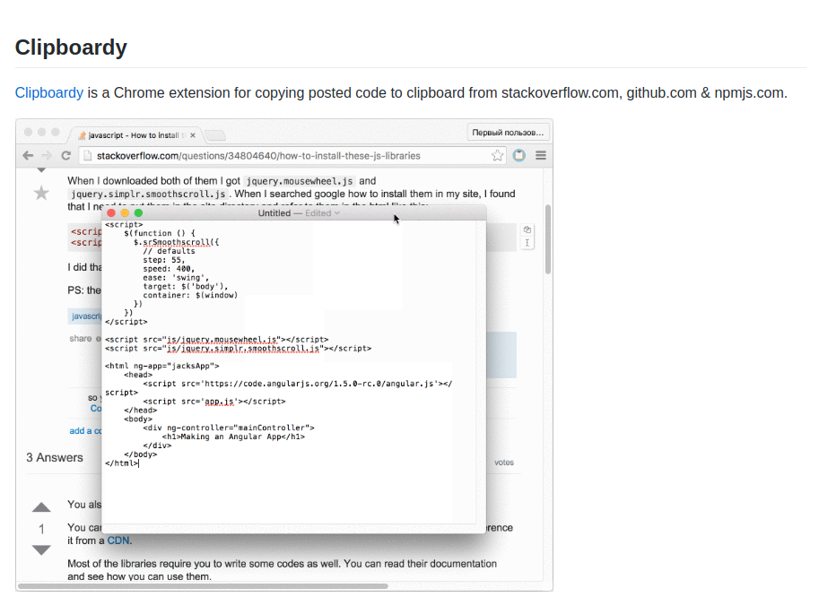

You have decided to start an open source project. You have worked a few months on an interesting problem. Finally, you wrote some notes in README.md and released version 1.0. 

After a few weeks, the interest in the project is still low. You've worked a lot for free, giving the best efforts, but in the end, few people are interested.  

How could that happen? And more importantly, what to do to make your open source project successful?  

I've built an open source library [vocajs.pages.dev](https://vocajs.pages.dev) that [managed](/announcing-voca-the-ultimate-javascript-string-library/) to rise to the top trending repositories on GitHub. Along the way, I learned some important principles of how to make a quality open source project. I want to share these ideas.  

## 1. No one cares about your project

First of all, as an author, shift your thoughts about open source. You might think that if putting a lot of effort into the project (library, tool, framework, etc) that's interesting to you, a lot of developers are going to get excited as well.  

Unfortunately, that's far from the truth...

It might sound harsh, but developers out there are only interested in *solving their problems*. So when someone visits your repository, one is searching for a solution. 

## 2. Solve a real problem

Before even starting the open source project, before even writing the first line of code, invest a lot of time in finding a real problem to solve.  

To summarize, a good open source project solves a problem that developers are actively searching for a solution.  

Regarding my experience, I decided to write a JavaScript string library. My main reasoning was that the existing at that time solutions were of low quality. Plus JavaScript itself doesn't have an extensive standard string library. 

I wasn't particularly enthusiastic about strings. Creating such a library might even be boring... But what's more important I found a decent problem to solve.  

Some strategies to find good problems to solve:

* Think about a problem you are experiencing. Can you create a solution for it?  
* Explore open source projects that are widely used, but are mediocre. It's ok to implement your own better solution. 
* Search for ideas in GitHub issues of popular repositories, Stackoverflow questions, or even Twitter.

### Key takeaway

> A successful open source project solves a known *problem*

## 3. Put an accent on quality

Most developers work in closed-source projects. Except for your teammates, most likely a few developers are going to read your code.  

But the situation is different when your code is opened for everyone. 

The truth is a lot of open source code is not the best quality. Nobody wants to depend on code that is difficult to understand, unstable and full of bugs.  

In this regards a good way to increase trust and demonstrate the quality of your open source project is testing it. You might need to have at least 80% of code coverage.  

You can even go further and put some badges on README.md to demonstrate that the codebase is fully tested. 

The readability of the source is also an important aspect. If you want at later stages to attract more contributors, the code must be readable and well structured.  

Additionally, the open source tool will only benefit from implementing non-functional requirements:

* Have an intuitive, configurable and extensible API
* Support a wide range of environments (cross-platform, cross-browser, etc)
* Provide the possibility to cherry-pick functionality
* Have few but ideally no dependencies 
* Have small build size

### Key takeaway

> A successful open source project has *quality code* and *high code coverage*

## 4. Excellent README.md and documentation

Ok, you followed my advice, found a decent problem and implemented a relatively good solution. Is it enough?  

Unfortunately, only half of the job is done...

README.md file is the entry point of the project. And if you struggle to explain concisely and exactly what the project does, people will hardly understand its mission and will bounce-off.  

In case if README.md lacks details, you might think that developers are going to dive into implementation details and find by themselves how to use the tool. Usually, that's not going to happen because nobody likes deciphering code.  

What everyone expects is to understand what problem your tool solves and how to use it. That's all.  

Let me tell you one truth that worked for me well: 

*Invest 50% of the time writing compelling README.md and straightforward documentation.* 

Yes, you read it right. Spend half of the time explaining what the project does and how to use it.  

### 4.1 README.md

The README.md file is what a user sees first when visiting the repository. You have only 20-30 seconds of attention to sell what you have.  

I advise README.md to contain the following sections.  

**1. The mission**

Begin with a short sentence explaining the mission of your project: *"What does it do?"* Place it right after the title of the project.  

For example, in case of my open source library Vocajs, I use the following one-sentence explanation: 

"*Voca* is a JavaScript library for manipulating strings"

This sentence instantly tells you what my project does: a JavaScript library that manipulates strings.  

Right after the mission insert the link to detailed documentation, if you have one.  

**2. The description**

After the mission follows a brief description: *"Why should I use it?"* It should slightly detail the mission.  

For example, this is what I use for description:

"The *Voca* library offers helpful functions to make string manipulations comfortable: *change case, trim, pad, slugify, latinise, sprintf'y, truncate, escape* and much more. The *modular design* allows to load the entire library, or individual functions to minimize the application builds. The library is *fully tested*, *well documented* and *long-term supported*."

Don't put too many technical details into the description. Just highlight the good parts.  

**3. The features**

After that, you can go a bit deeper into technical details by listing the features: *"What features does it provide?"*.  

Use a list for an easier read.  

**4. Installation and usage**  

Finally, describe *"How do I install it and configure?"* 

Here you can insert again a link to detailed documentation if you have one.  

Feel free to explore https://github.com/panzerdp/voca/ as an example.  

### 4.2 Documentation

If the project is large, README.md might not fit detailed API documentation. Create an additional page solely describing the API.  

Examples of detailed documentation: [lodash](https://lodash.com/docs/), [ant.design](https://ant.design/docs/react/getting-started).  

The documentation explains concisely and to the point all the usage aspects. For example: enumerate the function's parameters, state what data types are accepted, give appropriate examples.  

Here's how I documented the [v.kebabCase()](https://vocajs.pages.dev/#kebabCase) function of my library:  

You can easily understand how to use `kebabCase()` function: what it does, what parameters it accepts, and the returned value. A few examples are presented as well. You can even find links to the source code and the unit test.  

### Key takeaway

> A successful open source project has a *compelling README.md* and *excellent documentation*

## 5. Showcase with demos and screenshots 

Humans are visual creatures. That's why if you build a visual tool (chart, UI widget, mobile/desktop application, etc), I strongly recommend to include demos and screenshots.  

A good demo is worth a thousand words.  

For example, I implemented a small open source Chrome extension [Cliboardy](https://chrome.google.com/webstore/detail/clipboardy/gkafpbdjggkmmngaamlghmigadfaalhc). It copies posted code to clipboard from stackoverflow.com, github.com & npmjs.com.  

Instead of having a long text with explanations, right at the beginning of the [README.md](https://github.com/panzerdp/clipboardy) I present a demo gif:  

Looking at this demo, you don't even have to read the description. It's spot-on.  

## 6. Try building a community

A good part of managing the open source project is dealing with people: communicate with users, implement new features, fix bugs.  

While it might seem secondary at first, communication is a complex task. Responding to issues and reviewing pull requests can take more time than expected.   

Sometimes you will deal with frustrated users, anyways find the will to communicate politely with everyone.  

Be ready to say "No" to certain requests or reject pull requests. Always try to explain politely your decisions and gratify contributor for spending his time.  

The goal is to attract new contributors to your project. Some say that popular open source projects are based on a strong community of contributors.  

### Key takeaway

> A successful open source project is built on *efficient communication* and *active community*

## 7. Let the world know

Everything's ready. Your project reached version 1.0, has a great README.md and documentation.  

Now it's time to promote your open source project: let the world know about it.  

Share your repository on sites like [reddit.com](https://www.reddit.com/) (into one or more corresponding subreddits), [news.ycombinator.com](https://news.ycombinator.com/), [echojs](http://www.echojs.com/), Twitter, and alike. With a bit of luck, your project could have a good start in popularity.  

But there are 2 nuances to be aware of.

First, resist the urge to publish a project that is not completed. Polish everything. *You never get a second chance to make a good first impression.*  

Second, sharing on sites like Reddit might lead to some ego-killer or harsh comments about your work. Don't let these comments demotivate you in any way. 

It's easy to criticize, but it's hard to create. Remember that you, the one that creates, are the hero of the day.  

Accept constructive criticism, and simply ignore the trash comments.  

## 8. Conclusion

A successful open source project requires a lot of time and commitment.  

First of all the project must solve a problem, and solve it good. Developers are searching for good solutions for their problems.  

You must invest about 50% of the time into creating quality README.md and detailed documentation. Tool usage should be effortless as much as possible for the user.  

Having a decent code coverage builds trust in the quality of your code. Do not forget to invest in non-functional requirements also, like supporting many environments and have few dependencies.  

Try to communicate with the users of the project. They will often report issues and suggest improvements. Favor polite and constructive communication: your goal is to attract contributors.  

If you want to know more, I recommend reading ["Producing Open Source Software"](https://producingoss.com/) free book.  

*What other tactics do you know to make an open source project successful?*