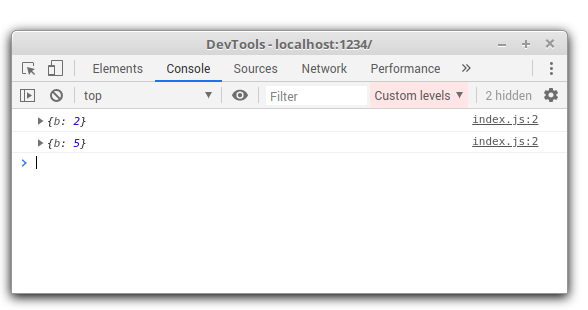
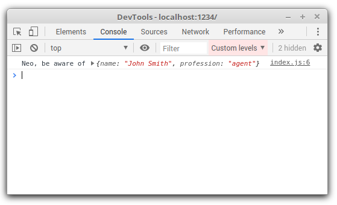
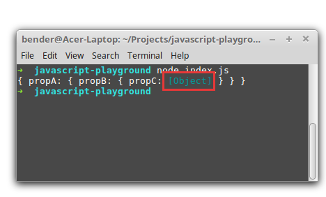

`console.log(message)` usage is simple: the argument `message` is logged to console.

```javascript
console.log('My message');
// logs "My message"

const myVar = 12;
console.log(myVar);
// logs 12
```

This post presents 5 useful tips to help you become more productive when using `console.log()`.

<Affiliate type="traversyJavaScript" />

<TableOfContents />

## 1. Naming logged variables

When logging many variables, sometimes it's difficult to understand what variable corresponds to a log in the console.  

For example, let's log some variables:

```javascript{1}
function sum(a, b) {
  console.log(b);
  return a + b;
}

sum(1, 2);
sum(4, 5);
```

When the above code is executed, you'll see just a series of numbers:


To make an association between the logged value and variable, wrap the variable into a pair of curly braces `{ b }`:

```javascript{1}
function sum(a, b) {
  console.log({ b });
  return a + b;
}

sum(1, 2);
sum(4, 5);
```

Now looking at the console, you can see that exactly variable `b` is being logged:



## 2. Advanced formatting

The most common way to log something to console is to simply call `console.log()` with one argument:

```javascript
console.log('My message');
// logs "My message"
```

Sometimes you might want a message containing multiple variables. Fortunately, `console.log()` can format the string in a `sprintf()` way using specifiers like `%s`, `%i`, etc.

For example, let's format a message containing a string and an integer:

```javascript
const user = 'john_smith';
const attempts = 5;

console.log('%s failed to login %i times', user, attempts);
// logs "john_smith failed to login 5 times"
```

`%s` and `%i` are replaced with values of `user` and `attempts`. The specifier `%s` is converted to a string, while `%i` is converted to a number.  

Here's a list of available specifiers:

| Specifier    |    Purpose                                                        |
|--------------|-------------------------------------------------------------------|
| `%s`         |  Element is converted to a string                                 |
| `%d` or `%i` |  Element is converted to an integer                               |
| `%f`         |  Element is converted to a float                                  |
| `%o`         |  Element is displayed with optimally useful formatting            |
| `%O`         |  Element is displayed with generic JavaScript object formatting   |
| `%c`         |  Applies provided CSS                                             |


## 3. Log with style

Browser console lets you apply styles to the logged message.  

You can do this by using the `%c` specifier with the corresponding CSS styles. For example, let's a log message with increased font size and font weight:

```javascript
console.log('%c Big message', 'font-size: 36px; font-weight: bold');
```

The specifier `%c` applies the CSS styles `'font-size: 36px; font-weight: bold'`.

Here's how the log with applied styles looks in Chrome console:


## 4. Interactive logs

Log styling depends on the host's console implementation. Browsers like Chrome and Firefox offer interactive logs of objects and arrays, while Node console outputs logs as text.  

Let's see how Chrome logs the plain objects, arrays and DOM trees. You can interact with these elements by expanding and collapsing.  

### 4.1 Objects

```javascript
const myObject = {
  name: 'John Smith',
  profession: 'agent'
};

console.log(myObject);
```

In Chrome console the log of `myObject` looks like:


You can expand and collapse the list of object properties. As well you can see the prototype of the object.  

### 4.2 Arrays

```javascript
const characters = ['Neo', 'Morpheus', 'John Smith'];

console.log(characters);
```

Chrome logs the `characters` array as follows:


### 4.3 DOM trees

You can interact directly with a DOM element that is displayed in the console.  

```javascript
console.log(document.getElementById('root'));
```

In Chrome console, the DOM element can be expanded and its content can be explored in full:


### 4.4 Interactive logs inside messages

The `%o` specifier (which associates the right log formatting for the value) can insert arrays, objects, DOM elements, and regular text into a textual message, without losing the interactivity.  

The following snippet logs a message containing an object:

```javascript
const myObject = {
  name: 'John Smith',
  profession: 'agent'
};

console.log('Neo, be aware of %o', myObject);
```

Looking at the console, the `myObject` array isn't converted to a string, but rather is being kept interactive.  



## 5. Logging big objects in Node console

The logs in Node are output as plain text. However, `console.log()` in Node doesn't display objects with a deep level of nesting: objects at level 3 are shown as `[Object]`.

For example, let's log the following object:

```javascript
const myObject = {
  propA: {
    propB: {
      propC: {
        propD: 'hello'
      }
    }
  }
};

console.log(myObject);
```

When running the script, the object of `propC` is logged as `[Object]`:



### 5.1 Stringify the big object

To see the full object structure, I log the JSON representation of the object using `JSON.stringify()`:

```javascript
const myObject = {
  propA: {
    propB: {
      propC: {
        propD: 'hello'
      }
    }
  }
};

console.log(JSON.stringify(myObject, null, 2));
```

`JSON.stringify(myObject, null, 2)` returns a JSON representation of the object. The third argument `2` sets the indent size in spaces.  

Now the object is logged entirely and nicely formatted:


### 5.2 console.dir() with unlimited depth

A good alternative in displaying the object in depth is to invoke [console.dir()](https://nodejs.org/api/console.html#console_console_dir_obj_options) without limiting the depth of the object:

```javascript
const myObject = {
  propA: {
    propB: {
      propC: {
        propD: 'hello'
      }
    }
  }
};

console.dir(myObject, { depth: null });
```

`console.dir()` invoked with `{ depth: null }` as the second argument logs the object in depth.  

Here's how the log looks in console:


Hopefully, these 5 tips will make your logging experience in JavaScript more productive.  

*What logging tips do you use? Please write a comment below!*
