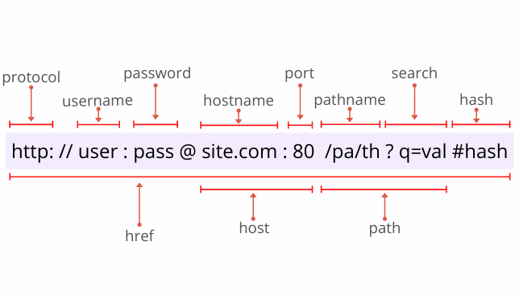

A Uniform Resource Locator, abbreviated **URL**, is a reference to a web resource (web page, image, file). The URL specifies the resource location and a mechanism to retrieve the resource (http, ftp, mailto).  

For example, here's the URL of this blog post:

```
https://dmitripavlutin.com/parse-url-javascript
```

Often you need to access specific components of an URL: the *hostname* (e.g. `dmitripavlutin.com`), or *pathname* (e.g. `/parse-url-javascript`).   

A convenient parser to access components of an URL is the `URL()` constructor.    

In this post, I'm going to show you the structure of an URL and its main components. Then, I'm going to describe how to use the `URL()` constructor to easily pick components of an URL like hostname, pathname, query, or hash. 

<Affiliate />

<TableOfContents />

## 1. URL structure

An image worth a thousand words. Without much textual description, in the following image you can find the main components of an URL:



## 2. URL() constructor

The `URL()` is a constructor function to parse components of an URL:

```javascript
const url = new URL(relativeOrAbsolute [, absoluteBase]);
```

`relativeOrAbsolute` argument can be either an absolute or relative URL. If the first argument is relative, then the second argument `absoluteBase` is obligatory and must be an absolute URL being the base for the relative path.   

For example, let's initialize `URL()` with an absolute URL:

```javascript
const url = new URL('http://example.com/path/index.html');

console.log(url.href); // => 'http://example.com/path/index.html'
```
[Open the demo.](https://jsfiddle.net/dmitri_pavlutin/y2qbsptL/)

or combine relative and absolute URLs:

```javascript
const url = new URL('/path/index.html', 'http://example.com');

console.log(url.href); // => 'http://example.com/path/index.html'
```
[Open the demo.](https://jsfiddle.net/dmitri_pavlutin/gn975bu6/)

The `href` property of the `URL()` instance returns the entire URL string.  

After creating an `URL()` instance, you can access any URL component presented in the [previous picture](#1-url-structure). For reference, here's the `URL()` instance interface:

```typescript
interface URL {
  href:     USVString;
  protocol: USVString;
  username: USVString;
  password: USVString;
  host:     USVString;
  hostname: USVString;
  port:     USVString;
  pathname: USVString;
  search:   USVString;
  hash:     USVString;

  readonly origin: USVString;
  readonly searchParams: URLSearchParams;

  toJSON(): USVString;
}
```

where `USVString` type maps to a string when returned in JavaScript.  

## 3. Query string

`url.search` property accesses the query string of the URL (the one that starts with `?`):

```javascript
const url = new URL(
  'http://example.com/path/index.html?message=hello&who=world'
);

console.log(url.search); // => '?message=hello&who=world'
```
[Open the demo.](https://jsfiddle.net/dmitri_pavlutin/2p1qh3ua/)

If the query string is missing, `url.search` evaluates to an empty string `''`:

```javascript
const url1 = new URL('http://example.com/path/index.html');
const url2 = new URL('http://example.com/path/index.html?');

console.log(url1.search); // => ''
console.log(url2.search); // => ''
```
[Open the demo.](https://jsfiddle.net/dmitri_pavlutin/zwa6rn23/)

### 3.1 Parsing the query string

But more often you might need to access a specific query parameter.  

An easy way to pick query parameters gives `url.searchParams` property. This property holds an instance of [URLSearchParams](https://developer.mozilla.org/en-US/docs/Web/API/URLSearchParams).  

`URLSearchParams` object provides lots of methods (like `get(param)`, `has(param)`) to access the query string parameters.  

Let's look at an example:

```javascript
const url = new URL(
  'http://example.com/path/index.html?message=hello&who=world'
);

console.log(url.searchParams.get('message')); // => 'hello'
console.log(url.searchParams.get('missing')); // => null
```
[Open the demo.](https://jsfiddle.net/dmitri_pavlutin/msz6jk0t/1/)

`url.searchParams.get('message')` returns the value of `message` query parameter &mdash; `'hello'`.  

But accessing a non-existing parameter `url.searchParams.get('missing')` evaluates to `null`.  

## 4. hostname

`url.hostname` property holds the hostname of the URL:

```javascript
const url = new URL('http://example.com/path/index.html');

console.log(url.hostname); // => 'example.com'
```
[Open the demo.](https://jsfiddle.net/dmitri_pavlutin/5armb03u/)

## 5. pathname

`url.pathname` property accesses the pathname of the URL:

```javascript
const url = new URL('http://example.com/path/index.html?param=value');

console.log(url.pathname); // => '/path/index.html'
```
[Open the demo.](https://jsfiddle.net/dmitri_pavlutin/842Lez7h/)

If the URL doesn't have a path, the `url.pathname` property returns a slash character `/`:

```javascript
const url = new URL('http://example.com/');

console.log(url.pathname); // => '/'
```
[Open the demo.](https://jsfiddle.net/dmitri_pavlutin/nsqo4xpL/)

## 6. hash

Finally, the hash is accessed using `url.hash` property:

```javascript
const url = new URL('http://example.com/path/index.html#top');

console.log(url.hash); // => '#top'
```
[Open the demo.](https://jsfiddle.net/dmitri_pavlutin/5x19cLba/)

When the hash in the URL is missing, `url.hash` evaluates to an empty string `''`:

```javascript
const url = new URL('http://example.com/path/index.html');

console.log(url.hash); // => ''
```
[Open the demo.](https://jsfiddle.net/dmitri_pavlutin/r3eL264m/)

## 7. URL validation

When `new URL()` constructor creates an instance, as a side effect, it also validates
the URL for correctness. A `TypeError` is thrown if the URL value is invalid.  

For example, `http**://example.com` is an invalid URL because of the `**` characters after `http`.  

Let's use this invalid URL to initialize the parser:  

```javascript mark=7
try {
  const url = new URL('http**://example.com');
} catch (error) {
  console.log(error); // => TypeError, "Failed to construct URL: Invalid URL"
}
```
[Open the demo.](https://jsfiddle.net/dmitri_pavlutin/qw45mhde/1/)

Because `'http**://example.com'` is an invalid URL, as expected, `new URL('http**://example.com')` throws a `TypeError`.  

## 8. URL manipulation

Aside from accessing URL components, the properties like `search`, `hostname`, `pathname`, `hash` are writeable &mdash; thus you can manipulate the URL.  

For example, let's modify the hostname of an existing URL from `red.com` to `blue.io`:

```javascript
const url = new URL('http://red.com/path/index.html');

console.log(url.href); // => 'http://red.com/path/index.html'

url.hostname = 'blue.io';

console.log(url.href); // => 'http://blue.io/path/index.html'
```
[Open the demo.](https://jsfiddle.net/dmitri_pavlutin/3anL24y6/)

Only `origin` and `searchParams` properties of the `URL()` instance are readonly. The other ones are writable and modify the URL when you change them.  

## 9. Summary

The `URL()` constructor is handy for parsing (and validating) URLs in JavaScript.  

`new URL(relativeOrAbsolute [, absoluteBase])` accepts as the first argument an absolute or relative URL. When the first argument is relative, you have to indicate the second argument as an absolute URL that serves as the base for the first argument.    

After creating the `URL()` instance, you can easily access the most common URL components like:

* `url.search` for raw query string
* `url.searchParams` for an instance of `URLSearchParams` to pick query string parameters
* `url.hostname` to access the hostname
* `url.pathname` to read the pathname
* `url.hash` to determine the hash value

In terms of browser support, `URL` constructor is [available](https://caniuse.com/#feat=url) in modern browsers. However, it is not available in Internet Explorer.  

*What is your favorite tool to parse URLs in JavaScript?*
