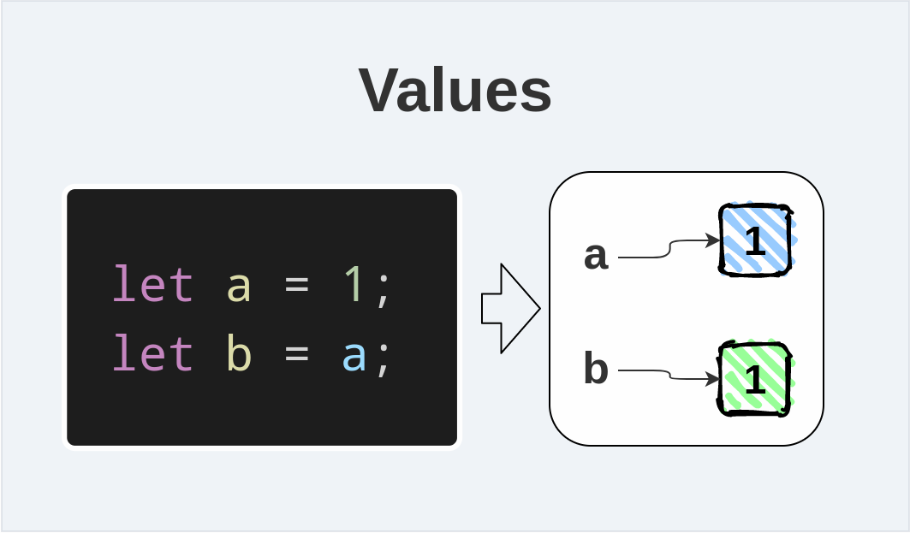

In JavaScript, you can pass by value and by reference.

The main difference between the two is that passing by value happens when assigning primitives while passing by reference when assigning objects.   

Let's discuss values and references in more detail in this post.  

<Affiliate type="traversyJavaScript" />

## 1. Understanding primitive and objects

JavaScript provides 2 categories of data types: *primitives* and *objects*.  

The primitives are numbers, booleans, strings, symbols, and special values `null` and `undefined`.  

```javascript
// Primitives
const number = 10;

const bool = false;

const str = 'Hello!';

const missingObject = null;

const nothing = undefined;
```

The second category is objects. Particularly the plain object, arrays, functions, and more &mdash; are all objects.  

```javascript
// Objects
const plainObject = {
  prop: 'Value'
};

const array = [1, 5, 6];

const functionObject = (n1, n2) => {
  return n1 + n2;
};
```

Saying it differently, anything that is not a primitive value is an object.  

## 2. Values

The simple rule of passing by value is that all primitive values in JavaScript are passed by value. Simple as that.  

Passing by value means that every time you assign a value to a variable, a copy of that value is created. Every single time.  



Let me show you how pass by value manifests itself.  

Let's say you have 2 variables `a` and `b`:

```javascript
let a = 1;
let b = a;

b = b + 2;

console.log(a); // 1
console.log(b); // 3
```

The first statement `let a = 1` defines a variable `a` initialized with the number `1`.  

The second statement `let b = a` defines another variable `b` and initializes it with the value of `a` variable &mdash; which is passing by value. Simpler, a copy of the number `1` is assigned to `b`.  

Later, `b = b + 2` increases by `2` and becomes `3`. `b` variable changes, and this change doesn't affect the value of `a`.  

## 3. References

The pass by reference, however, manifests itself differently.  

When creating an object you're given a reference to that object. If 2 variables hold the same reference, then changing the object reflects in both variables.  


Let's check the following code sample:

```javascript
let x = [1];
let y = x;

y.push(2);

console.log(x); // [1, 2]
console.log(y); // [1, 2]
```

The first statement `let x = [1]` creates an array, defines a variable `x`, and initializes the variable with a reference to the created array.  

Then `let y = x` defines a variable `y`, and initializes `y` with the reference stored in `x` variable. This is a pass by reference.  

`y.push(2)` mutates the array by pushing an item `2`. Because `x` and `y` variables reference the same array, this change is reflected in both variables.  

*Note: for simplicity, I say that variables hold references to objects. But strictly saying variables in JavaScript hold values that are references to objects*.

## 4. Comparing values and comparing references

Understanding the difference between values and references is important when you want to compare objects.  

When using the strict comparison operator `===`, 2 variables having values are equal if they have the same value. All of the below comparisons are equal:

```javascript
const one = 1;
const oneCopy = 1;

console.log(one === oneCopy); // true
console.log(one === 1);       // true
console.log(one === one);     // true
```

`one` and `oneCopy` have the same value `1`. The operator `===` evaluates to `true` as longs as both operands are `1`, no matter where the value is taken from: a literal `1`, variable's value, expression `2 - 1`.  

But the comparison operator `===` works differently when comparing references. 2 references are equal only if they reference exactly the same object. 

`ar1` and `ar2` hold references to different array instance:

```javascript
const ar1 = [1];
const ar2 = [1];

console.log(ar1 === ar2); // false
console.log(ar1 === [1]);  // false

const ar11 = ar1;
console.log(ar1 === ar11); // true
console.log(ar1 === ar1);  // true
```

`ar1` and `ar2` reference arrays of the same structure, however `ar1 === ar2` evaluates to `false` because `ar1` and `ar2` reference different array objects.  

The comparison operator returns `true` only when comparing references pointing to the same object: `ar1 === ar11` or `ar1 === ar1`.  

## 5. Summary

In JavaScript primitive types are passed around as values: meaning that each time a value is assigned, a copy of that value is created.  

On the other side objects (including plain objects, array, functions, class instances) are references. If you modify the object, then all variables
that reference that object are going to see the change.  

The comparison operator distinguishes comparing values and references. 2 variables holding references are equal only if they reference exactly the same object, but 2 variables holding values are equal if they simply have 2 same values no matter where the value originates: from a variable, literal, etc.  

Often, however, you might want to compare objects by their structure rather than by reference. Check out the post [How to Compare Objects in JavaScript](/how-to-compare-objects-in-javascript).