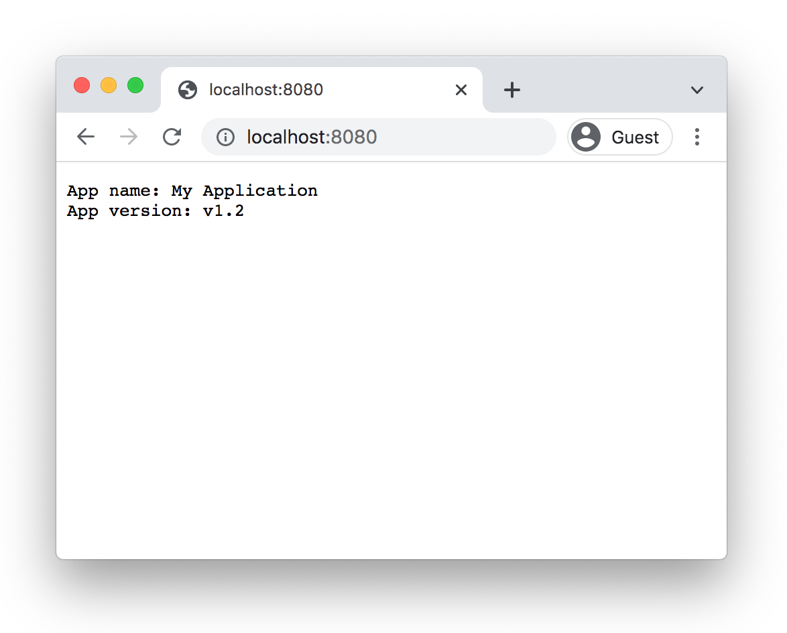

The ECMAScript modules system (`import` and `export` keywords) by default can import only JavaScript code.  

But it's often convenient to keep an application's configuration inside of a JSON file, and as result, you might want to
import a JSON file directly into an ES module.  

For a long time, importing JSON was supported by commonjs modules format.  

Fortunately, a new proposal at stage 3 named [JSON modules](https://github.com/tc39/proposal-json-modules) proposes a way to import JSON into an ES module. Let's see how JSON modules work.

<Affiliate type="traversyJavaScript" />

## 1. Importing config.json

Let's start with a JSON file named `config.json` that contains useful config values of an application: the name and the current version.  

```json
{
  "name": "My Application",
  "version": "v1.2"
}
```

How to import `config.json` into an ES module?  

For example, let's create a simple web application that renders the application name and version from the JSON configuration file.  

If you try to import `config.json` directly, Node.js will throw an error:

```javascript
import http from 'http';
import config from './config.json';

http
  .createServer((req, res) => {
    res.write(`App name: ${config.name}\n`);
    res.write(`App version: ${config.version}`);
    res.end();
  })
  .listen(8080);
```

When trying to run the application, Node.js throws an error `TypeError [ERR_UNKNOWN_FILE_EXTENSION]: Unknown file extension ".json"`.  


Node.js expects JavaScript code by default when using the `import` statement. But thanks to JSON module proposal, you can indicate the type of data you want to import: JSON.  

Before fixing the application, let's see in a few sentences what JSON module proposal is.   

## 2. JSON modules proposal

The essence of the [JSON modules proposal](https://github.com/tc39/proposal-json-modules) is to allow importing JSON data inside of an ES module using a regular `import` statement.  

JSON content can be imported by adding an import assertion:

```javascript
import jsonObject from "./file.json" assert { type: "json" };
```

`assert { type: "json" }` is an *import assertion* indicating the module should be parsed and imported as JSON.  

`jsonObject` variable contains the plain JavaScript object that's created after parsing the content of `file.json`.  

The content of a JSON module is imported using a default import. Named imports are not available.  

A JSON module can also be imported dynamically:

```javascript
const { default: jsonObject } = await import('./file.json', {
  assert: {
    type: 'json'
  }
});
```

When a module is imported dynamically, including a JSON module, the [default content](/ecmascript-modules-dynamic-import/#22-importing-of-default-export) is available at `default` property.  

The import assertion, in this case, indicates a JSON type. However, there's a more general proposal [import assertions](https://github.com/tc39/proposal-import-assertions/) (currently at stage 3) that allows importing more data formats, like CSS modules.  

## 3. Enabling JSON modules

Now, let's integrate JSON module into the web application:

```javascript
import http from 'http';
import config from './config.json' assert { type: "json" };

http
  .createServer((req, res) => {
    res.write(`App name: ${config.name}\n`);
    res.write(`App version: ${config.version}`);
    res.end();
  })
  .listen(8080);
```

The main module now imports the `config.json` file, and access its values `config.name` and `config.version`.  



JSON modules work in Node.js version `>=17.1`, also by using `--experimental-json-modules` flag to enable [Experimental JSON modules](https://nodejs.org/api/esm.html#esm_experimental_json_modules):

```bash
node --experimental-json-modules index.mjs
```

In a browser environment, the JSON modules are available starting Chrome 91.  

## 4. Conclusion

By default, an ES module can import only JavaScript code.  

Thanks to the JSON modules proposal you can import JSON content directly into an ES module. Just use an import assertion right after the import statement:  

```javascript
import jsonContent from "./file.json" assert { type: "json" };
```

You can use JSON modules starting Node.js 17.1 with the experimental flag `--experimental-json-modules` and in Chrome 91 and above.