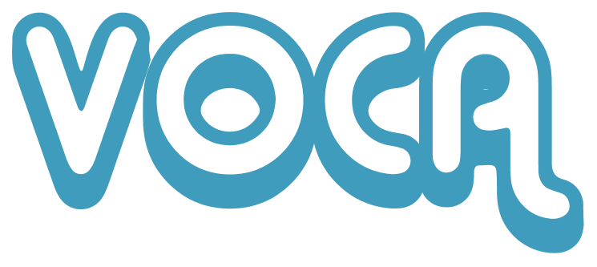

Open source changed the software development. And it changes the developers. Many libraries, apps, servers, and much more are powered by open source software.  

## Catch the open source wave

I always wanted to create and maintain an open source project. It is a must experience for every software developer.

This way I started to work on a JavaScript library called *Voca*. It's main scope is to facilitate the string manipulations in JavaScript.  

[[size12]]
| 

From the start I setup for myself the following quality obligations:

* The library must be *modular*. It should contain *small and independent functions* that do one thing, but do it well
* Detailed and easy to follow *documentation*
* *100% code coverage*. Tests are equally imporant as the library code itself
* Support most of the environments: Node.JS, newest and older browsers

## The Voca library

After 6 months of hard work, I recently released  the finished version of the library.  

```javascript
var v = require('voca');
v.camelCase('bird flight');              // => 'birdFlight'
v.sprintf('%s costs $%.2f', 'Tea', 1.5); // => 'Tea costs $1.50'
v.slugify('wonderful world');            // => 'wonderful-world'
```

The Voca library offers helpful functions to make string manipulations comfortable: *change case*, *trim*, *pad*, *slugify*, *latinise*, *sprintf*'y, *truncate*, *escape* and much more. The *modular design* allows to load the entire library, or individual functions to minimize the application builds. The library is *fully tested*, *well documented* and *long-term supported*.

Check more details on:

* The official documentation site: [https://vocajs.com](https://vocajs.com)
* The Github repository: [https://github.com/panzerdp/voca](https://github.com/panzerdp/voca)

The library is published on npm, so you can install it already:
```bash
npm install voca
```

## Trending repository on GitHub

The Voca library was lucky enough to land *first one* in trending JavaScript repositories for 16 December 2016:   

[[size34]]
| 

This is a nice beginning. I hope the library will serve well JavaScript developers in the long run.  

*I suggest you to install and use the Voca library. Of course, do not hesitate to [star](https://github.com/panzerdp/voca) it!*