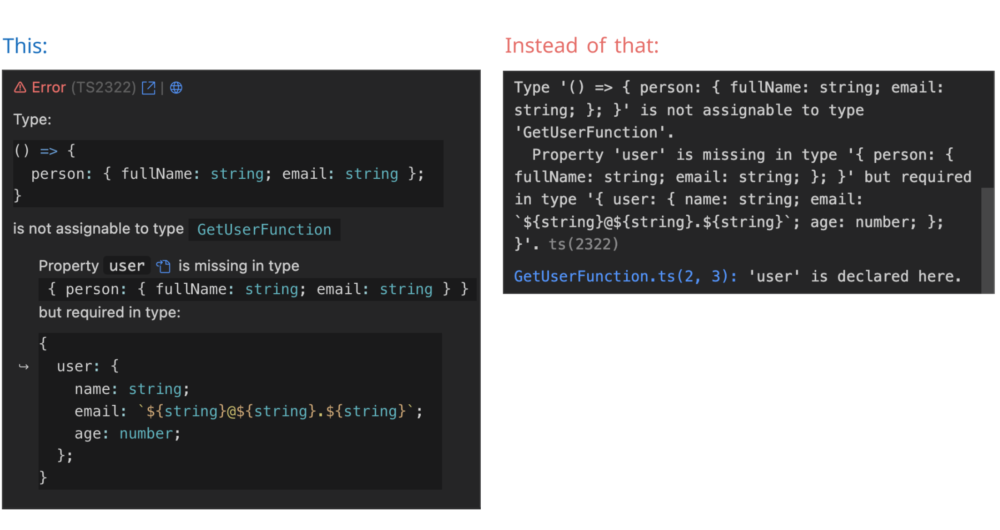
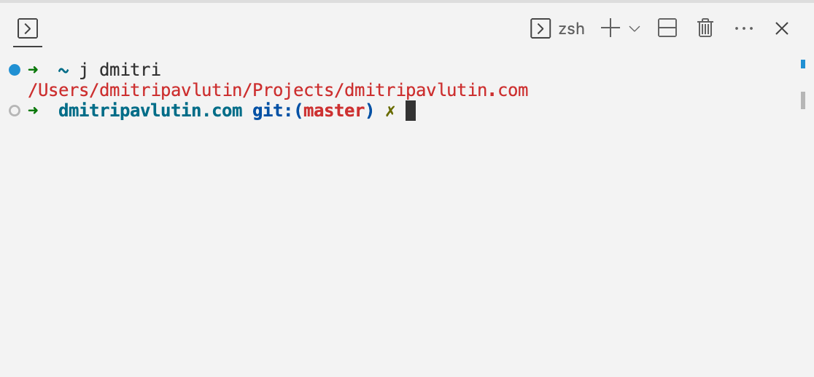

## Tip 1

How to fetch JSON from a remote API into the local state of a React component.  

#reactjs #fetch

Sign up to my newsletter to get more useful React.js tips: https://dmitripavlutin.com/newsletter/.

```jsx
import { useState, useEffect } from 'react'

function BasicFetch() {
  const [names, setName] = useState([])

  const fetchNames = async () => {
    const response = await fetch('/api/names/')
    setNames(await response.json())
  }
  useEffect(() => {
    fetchNames()
  }, [])

  return (
    <div>
      {names.map((name, i) => <div key={i}>{name}</div>)}
    </div>
  )
}
```

## Tip 2

React.js useEffect() hook behavior depending on the deps argument.

#reactjs

```javascript
useEffect(() => {
  // called after mounting
}, [])

useEffect(() => {
  // called after mounting
  // and after prop or state change
}, [prop, state])

useEffect(() => {
  // called after mounting
  // and after every re-rendering
})
```

## Tip 3

The arrow function doesn't define its own "this" value but resolves "this" value from the outer function.

#javascript

Sign up to my newsletter to get more useful JS tips: https://dmitripavlutin.com/newsletter/.

```javascript
const object = {
  method() {
    // logs true
    console.log(this === object)
    const func = () => {
      // logs true
      console.log(this === object)
    }
    func()
  }
}
object.method()
```

## Tip 4

Many developers, including myself, tend to jump right away into coding. Understanding the problem well is usually secondary.

But I have found that understanding the problem first, before coding, makes me a more productive developer.  

Only a good understanding of the problem makes a good solution.

Test-Driven Development encourages you to think about the problem first. That's why TDD makes you productive.  

## Tip 5

Be careful when updating the state in an effect that depends on the same state: that can create an infinite loop.

#reactjs

Sign up to my newsletter to get more useful React.js tips: https://dmitripavlutin.com/newsletter/.

```jsx
import { useState, useEffect } from 'react'

function MyComponent() {
  const [count, setCount] = useState(0)
  
  useEffect(() => {
    // Ininite loop!
    setCount(c => c + 1)
  }, [count])
  
  // ...
}
```

## Tip 6

How to get the parsed JSON from a fetch() response?

#javascript #fetch #http

Sign up to my newsletter to get more useful JavaScript tips: https://dmitripavlutin.com/newsletter/.

```javascript
// 1. Get the response object
const response = await fetch('https://mysite.com/users.json')

// 2. Get the parsed JSON from the response
const usersJson = await response.json()
```

## Tip 7

You make a change, and suddenly some other part of the application breaks. What is the common reason for such a fragile codebase?  

You might hear reasons like bad software design, missing tests, etc. While this is true, there is an elephant in the room.    

The accumulation of hundreds of short-sighted solutions and workarounds over the months and years.  

What should you do instead? Use the "Zero Tolerance" approach to short-sighted solutions to avoid them or refactor them as soon as possible.  

Deliberately dedicate 20% of your time to cleaning up your codebase.

#softwaredevelopment #softwaredesign

Sign up to my newsletter to get more useful software design tips: https://dmitripavlutin.com/newsletter/.


## Tip 8

How to prevent child components from useless re-rendering in React.js?  

An approach is to wrap your child components in React.useMemo().  

#reactjs 

Sign up to my newsletter to get more useful React.js tips: https://dmitripavlutin.com/newsletter/

```jsx
import { useState, useMemo } from 'react'

export function Parent() {
  const [count, setCount] = useState(0)
  const onClick = () => setCount(c => c + 1)

  return (
    <>
      <button onClick={onClick}>Increase {count}</button>
      {useMemo(() => {
        // Doesn't re-render even if `count` state changes
        return <Child />
      }, [])}
    </>
  )
}
```

## Tip 9

Why is using short-circuit && in JSX a code-smell? 

"{list.length && <Child list={list} />}" renders "0" if the list is empty.  

#reactjs

```jsx
function Parent({ list }) {
  return (
    <div>
      {list.length && <Child list={list} />} {/* Code-smell */}
      {list.length ? <Child list={list} /> : null} {/* Better */}
    </div>
  )
}
```

#reactjs

## Tip 10

fetch() API surprised me: it doesn't reject even if the response is 4xx or 5xx status. 

A common approach to solve this behavior is to manually throw an error when `response.ok` property is `false` (meaning the response ended in 4xx or 5xx status).

#javascript #fetch #http

Sign up to my newsletter to get more useful JavaScript tips: https://dmitripavlutin.com/newsletter/.

```javascript
async function fetchUsers() {
  const response = await fetch('https://mysite.com/users.json')
  if (!response.ok) {
    // Throw an error if the response status is 4xx or 5xx
    throw new Error('Failed to fetch')
  }
  return response.json()
}
```

## Tip 11

Do you find TypeScript errors difficult to understand? Then you'll love this new VSCode extension!

Just install "Pretty TypeScript Errors" VSCode extension https://marketplace.visualstudio.com/items?itemName=yoavbls.pretty-ts-errors.

The extension makes the TypeScript error reporting much more readable. Also provides a link to a more detailed error explanation and a possible solution.

#typescript #vscode



## Tip 12

Are you still manually typing the path to directories? You don't have to!

"autojump" CLI utility helps you navigate much faster between directories: https://github.com/wting/autojump

#cli



## Tip 13

How to let know TypeScript that a function is mocked?

"jest.mocked(source)" method wraps source with type definitions of Jest mock function.  

Read more: https://jestjs.io/docs/mock-function-api/#jestmockedsource-options

```typescript
import myFunc from './my-func'

jest.mock('./my-func')

jest.mocked(myFunc).mockReturnValue('Mocked!') // OK
myFunc.mockReturnedValue('Mocked!')            // TypeError!
```


## Tip 14

I follow a simple rule: "code without tests means not working code".

#tdd #unittesting